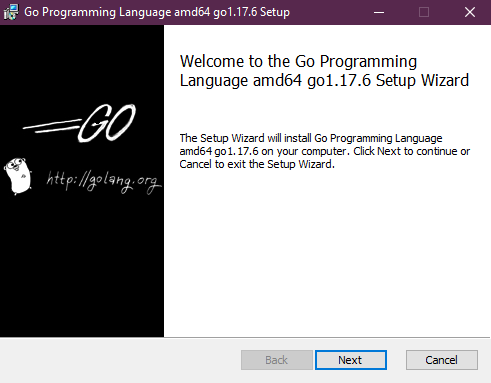
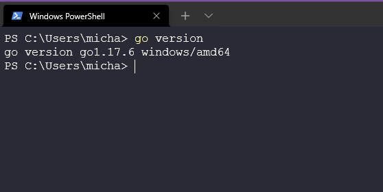
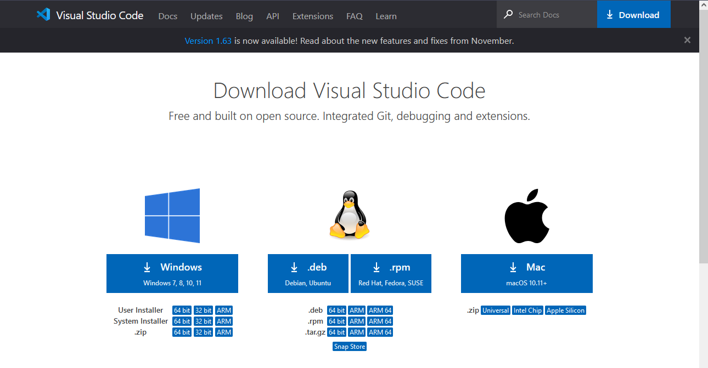

## Configurazione dell'ambiente DevOps per Go e Hello World

Prima di approfondire alcuni fondamenti di Go, dovremmo installare Go sulla nostra postazione di lavoro e fare ciò che prevede ogni tutorial che insegna a programmare, ovvero creare l'app Hello World. Poiché questa parte illustrerà i passaggi per installare Go sulla tua postazione di lavoro, cercheremo di documentare il processo con delle immagini in modo che tutti possano seguire facilmente.

Innanzitutto, dirigiamoci su [go.dev/dl](https://go.dev/dl/) dove troverai alcune opzioni disponibili per il download.


Se sei arrivato fin qui, probabilmente sai quale sistema operativo della postazione di lavoro stai utilizzando, quindi seleziona il download appropriato e poi procedi con l'installazione. Per questa guida sto usando Windows; in pratica, da questa schermata successiva, possiamo lasciare tutte le impostazioni predefinite per il momento. **_(Tieni presente che al momento della scrittura, questa era l'ultima versione, quindi gli screenshot potrebbero essere obsoleti)_**



Nota anche che, se hai già una versione precedente di Go installata, dovrai rimuoverla prima di procedere con l'installazione. Windows ha questa opzione integrata nell'installer pertanto rimuoverà la versione precedente e installerà quella nuova.

Una volta completata l'installazione, apri un prompt dei comandi, o il terminale, e verifichiamo se Go è stato installato. Se otterrai l'output che vediamo di seguito, allora Go è installato correttamente, altrimenti dovrai rifare i passaggi descritti.

Esegui il seguente comando:

```bash
go version
```



Ora, verifichiamo l'ambiente per Go. È sempre utile controllare se le directory di lavoro sono configurate correttamente. Come puoi vedere qui sotto, assicurati di avere la seguente directory nel tuo sistema.


Hai controllato? Sei con noi? Probabilmente otterrai qualcosa di simile a quanto mostrato sotto se provi a navigare in quella directory.


Va bene, creiamo quella directory: per comodità userò il comando `mkdir` nel mio terminale PowerShell. Inoltre, dobbiamo creare altre 3 cartelle all'interno della cartella Go, come vedrai nel passaggio successivo.


Ora abbiamo Go installato e la nostra directory di lavoro Go pronta. Abbiamo anche bisogno di un ambiente di sviluppo integrato (IDE). Ce ne sono molti disponibili, ma il più comune e quello che useremo è Visual Studio Code o Code. Puoi saperne di più sugli IDE [qui](https://www.youtube.com/watch?v=vUn5akOlFXQ).

Se non hai ancora scaricato e installato VSCode sulla tua postazione di lavoro, puoi farlo da [qui](https://code.visualstudio.com/download). Come puoi vedere di seguito, hai diverse opzioni per sistemi operativi.



Come per l'installazione di Go, scarica e installa VSCode mantenendo le impostazioni predefinite. Una volta completata l'installazione, apri VSCode e seleziona "Apri file" e naviga fino alla nostra directory Go creata in precedenza.


Potresti ricevere un warning sull'attendibilità della directory, leggila se vuoi e poi clicca su "Sì, mi fido degli autori." (Ma in futuro non aprire file o directory di cui non ti fidi!)

Ora dovresti vedere anche le tre cartelle create in precedenza, facciamo clic destro sulla cartella "src" per creare una nuova cartella chiamata `Hello`.


Fino a questo punto, direi che è stato tutto abbastanza facile, no? Adesso creeremo il nostro primo programma Go senza comprendere nulla di ciò che abbiamo messo nella prossima fase.

Quindi, crea un file chiamato `main.go` nella cartella `Hello`. Appena premi Invio su "main.go", ti verrà chiesto se desideri installare l'estensione di Go e anche i pacchetti. Puoi anche controllare il file pkg vuoto che abbiamo creato qualche passaggio indietro e noterai che ora ci sono nuovi pacchetti al suo interno.


Ora, facciamo funzionare questa app Hello World. Copia il seguente codice nel tuo nuovo file main.go e salvalo.

```go
package main

import "fmt"

func main() {
    fmt.Println("Hello #90DaysOfDevOps")
}
```

So che tutto questo potrebbe sembrare incomprensibile, ma nei prossimi giorni approfondiremo funzioni, pacchetti e altro. Per ora, eseguiamo il nostro programma. Torna al terminale, nella cartella "Hello" e controlliamo che tutto funzioni correttamente. Con il comando qui sotto, possiamo verificare se il nostro semplice programma di apprendimento funziona.

```bash
go run main.go
```


Ma non finisce qui, cosa succede se vogliamo ora eseguire il nostro programma su altre macchine Windows? Possiamo farlo creando il nostro file binario con il seguente comando:

```bash
go build main.go
```


Se eseguiamo il file, otterremo lo stesso output:

```bash
$ ./main.exe
Hello #90DaysOfDevOps
```

## Risorse

- [StackOverflow 2021 Developer Survey](https://insights.stackoverflow.com/survey/2021)
- [Why we are choosing Golang to learn](https://www.youtube.com/watch?v=7pLqIIAqZD4&t=9s)
- [Jake Wright - Learn Go in 12 minutes](https://www.youtube.com/watch?v=C8LgvuEBraI&t=312s)
- [Techworld with Nana - Golang full course - 3 hours 24 mins](https://www.youtube.com/watch?v=yyUHQIec83I)
- [**NOT FREE** Nigel Poulton Pluralsight - Go Fundamentals - 3 hours 26 mins](https://www.pluralsight.com/courses/go-fundamentals)
- [FreeCodeCamp - Learn Go Programming - Golang Tutorial for Beginners](https://www.youtube.com/watch?v=YS4e4q9oBaU&t=1025s)
- [Hitesh Choudhary - Complete playlist](https://www.youtube.com/playlist?list=PLRAV69dS1uWSR89FRQGZ6q9BR2b44Tr9N)

Ci vediamo al [Giorno 9](day09.md).

.
