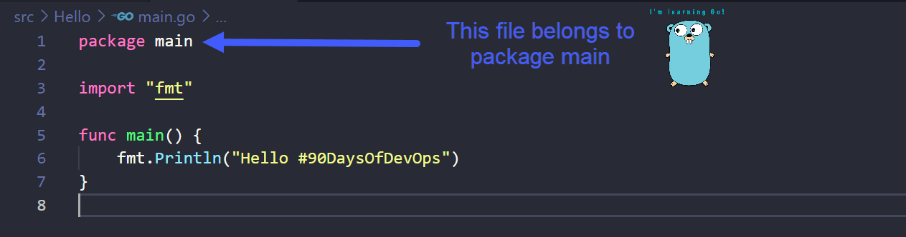
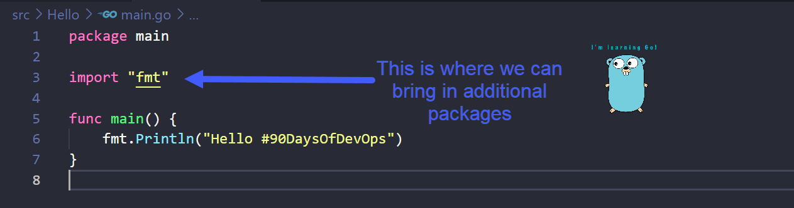

## Spieghiamo il codice Hello World

### Come funziona Go

Il [Giorno 8](day08.md) abbiamo visto come installare Go sulla tua postazione di lavoro e abbiamo creato la nostra prima applicazione Go.

In questa sezione, approfondiremo il codice e comprenderemo meglio alcuni aspetti del linguaggio Go.

### Cos'è la compilazione?

Prima di esaminare le [6 righe del codice Hello World](Go/hello.go), dobbiamo capire cosa significa compilare.

I linguaggi di programmazione che utilizziamo comunemente, come Python, Java, Go e C++, sono linguaggi di alto livello. Ciò significa che sono leggibili dagli esseri umani, ma quando una macchina cerca di eseguire un programma, deve essere in una forma comprensibile dalla macchina stessa. Dobbiamo tradurre il nostro codice leggibile dall'uomo in codice macchina, che viene chiamato compilazione.

Dall'immagine sopra, puoi vedere cosa abbiamo fatto nel [Giorno 8](day08.md): abbiamo creato un semplice main.go di Hello World e poi abbiamo utilizzato il comando `go build main.go` per compilare il nostro eseguibile.

### Cosa sono i pacchetti?

Un pacchetto è una raccolta di file sorgente nella stessa directory che vengono compilati insieme. Possiamo semplificarlo ulteriormente: un pacchetto è un gruppo di file .go nella stessa cartella. Ricorda la nostra cartella "Hello" dal Giorno 8? Quando lavorerai su programmi Go più complessi, potresti avere cartella1, cartella2 e cartella3 che contengono diversi file .go che compongono il tuo programma, con più pacchetti.

Usiamo i pacchetti per riutilizzare il codice di altre persone, quindi non dobbiamo scrivere tutto da zero. Ad esempio, se desideriamo una calcolatrice come parte del nostro programma, potremmo trovare un pacchetto Go esistente che contiene le funzioni matematiche da importare nel nostro codice, risparmiandoci molto tempo e sforzo a lungo termine.

Go ti incoraggia ad organizzare il tuo codice in pacchetti in modo che sia facile riutilizzarlo e mantenere il codice sorgente.

### Hello #90DaysOfDevOps, riga per riga

Ora diamo un'occhiata al nostro file main.go di Hello #90DaysOfDevOps e analizziamo le righe.

Nella prima riga, hai `package main`, il che significa che questo file appartiene a un pacchetto chiamato "main". Tutti i file .go devono appartenere a un pacchetto e dovrebbero anche avere `package qualcosa` nella riga di apertura.

Un pacchetto può essere chiamato come preferisci. Dobbiamo chiamarlo "main" poiché questo è il punto di avvio del programma che si troverà in questo pacchetto, ed è una regola (devo capire meglio questa regola?).

Ogni volta che vogliamo compilare ed eseguire il nostro codice, dobbiamo dire alla macchina da dove iniziare l'esecuzione. Lo facciamo scrivendo una funzione chiamata "main". La macchina cercherà una funzione chiamata "main" per trovare il punto di ingresso del programma.

Una funzione è un blocco di codice che può svolgere un compito specifico e può essere utilizzato in tutto il programma.

Puoi dichiarare una funzione con qualsiasi nome usando `func`, ma in questo caso dobbiamo chiamarla "main" poiché questo è il punto di inizio del codice.

Ora passeremo alla riga 3 del nostro codice, l'import. Questo significa che vogliamo includere un altro pacchetto nel nostro programma principale. "fmt" è un pacchetto standard utilizzato qui e fornito da Go, questo pacchetto contiene la funzione `Println()` e, poiché l'abbiamo importato, possiamo utilizzarla nella riga 6. Ci sono diversi pacchetti standard che puoi includere nel tuo programma e che puoi sfruttare o riutilizzare nel tuo codice, risparmiandoti il fastidio di dover scrivere tutto da zero. [Libreria standard di Go](https://pkg.go.dev/std)

La funzione `Println()` che abbiamo qui è un modo per scrivere l'output standard sul terminale ovunque l'eseguibile sia stato eseguito con successo. Sentiti libero di cambiare il messaggio all'interno delle parentesi ().

### In breve

- **Riga 1** = Questo file sarà nel pacchetto chiamato "main" e deve essere chiamato "main" poiché include il punto di ingresso del programma.
- **Riga 3** = Per usare `Println()` dobbiamo importare il pacchetto "fmt" per poterlo utilizzare nella riga 6.
- **Riga 5** = Il vero punto di inizio è la funzione "main".
- **Riga 6** = Ciò ci permetterà di stampare "Hello #90DaysOfDevOps" sul nostro sistema.

## Risorse

- [StackOverflow 2021 Developer Survey](https://insights.stackoverflow.com/survey/2021)
- [Why we are choosing Golang to learn](https://www.youtube.com/watch?v=7pLqIIAqZD4&t=9s)
- [Jake Wright - Learn Go in 12 minutes](https://www.youtube.com/watch?v=C8LgvuEBraI&t=312s)
- [Techworld with Nana - Golang full course - 3 hours 24 mins](https://www.youtube.com/watch?v=yyUHQIec83I)
- [**NOT FREE** Nigel Poulton Pluralsight - Go Fundamentals - 3 hours 26 mins](https://www.pluralsight.com/courses/go-fundamentals)
- [FreeCodeCamp - Learn Go Programming - Golang Tutorial for Beginners](https://www.youtube.com/watch?v=YS4e4q9oBaU&t=1025s)
- [Hitesh Choudhary - Complete playlist](https://www.youtube.com/playlist?list=PLRAV69dS1uWSR89FRQGZ6q9BR2b44Tr9N)

Ci vediamo al [Giorno 10](day10.md).
