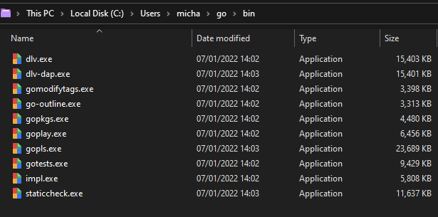
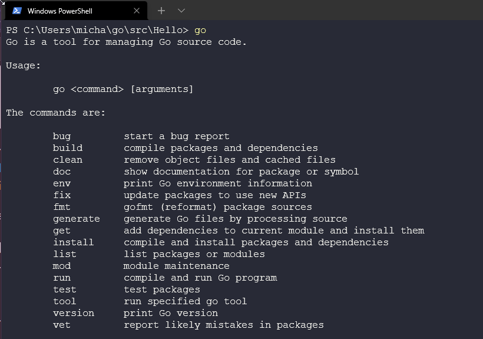

### Lo spazio di lavoro di Go

Nel [Giorno 8](day08.md) abbiamo brevemente esaminato lo spazio di lavoro di Go per farlo funzionare e arrivare alla demo di `Hello #90DaysOfDevOps`. Ma dovremmo spiegare un po' meglio lo spazio di lavoro di Go.

Ricordi che abbiamo scelto le impostazioni predefinite e poi abbiamo creato la nostra cartella Go nel GOPATH che era già definito, ma in realtà, questo GOPATH può essere modificato per essere ovunque tu voglia.

Se esegui il comando

```bash
echo $GOPATH
```

L'output dovrebbe essere simile al mio (con un nome utente diverso forse), che è:

```bash
/home/michael/projects/go
```

Quindi qui abbiamo creato 3 directories: **src**, **pkg** e **bin**


**src** è dove vengono memorizzati tutti i tuoi programmi e progetti Go. Questo si occupa della gestione dei nomi dei packages per tutti i tuoi repository Go. Qui vedrai sulla nostra postazione di lavoro la nostra cartella Hello per il progetto Hello #90DaysOfDevOps.


**pkg** è dove vengono archiviati i file delle librerie di packages che sono o sono stati installati nei programmi. Questo aiuta a velocizzare il processo di compilazione in base a se i pacchetti utilizzati sono stati modificati.


**bin** è dove vengono memorizzati tutti i file binari compilati.



Il nostro Hello #90DaysOfDevOps non è un programma complesso, quindi ecco un esempio di un programma Go più complesso preso da un'altra ottima risorsa degna di essere esaminata [GoChronicles](https://gochronicles.com/)


Questa pagina approfondisce anche alcuni dettagli interessanti su perché e come è strutturata in questo modo, e approfondisce anche altre cartelle che non abbiamo menzionato [GoChronicles](https://gochronicles.com/project-structure/)

### Compilazione ed esecuzione del codice

Nel [Giorno 9](day09.md) abbiamo anche brevemente introdotto la compilazione del codice, ma possiamo approfondire un po' di più l'argomento.

Per eseguire il nostro codice, prima dobbiamo **compilarlo**. Ci sono tre modi per farlo in Go.

- go build
- go install
- go run

Prima di arrivare alla fase di compilazione, dobbiamo dare un'occhiata a cosa abbiamo ottenuto con l'installazione di Go.

Quando abbiamo installato Go il Giorno 8, abbiamo installato anche i Go Toolls (ndt strumenti di Go), che consistono in diversi programmi che ci consentono di compilare e elaborare i nostri file sorgente Go. Uno di questi strumenti è `Go`

È utile notare che puoi installare anche strumenti aggiuntivi che non sono inclusi nell'installazione standard di Go.

Se apri il prompt dei comandi e digiti `go`, dovresti vedere qualcosa simile all'immagine qui sotto e quindi vedrai "Additional Help Topics" sotto, ma per ora non ce ne preoccupiamo.



Potresti anche ricordare di aver già usato almeno due di questi strumenti il Giorno 8.


Quelli che vogliamo conoscere meglio sono build, install e run.


- `go run` - Questo comando compila ed esegue il pacchetto principale composto dai file .go specificati sulla riga di comando. Il programma viene compilato in una cartella temporanea.
- `go build` - Serve per compilare packages e dipendenze, compila il package nella directory corrente. Se il progetto Go contiene un package `main`, il programma eseguibile verrà crreato nella directory corrente; altrimenti il file eseguibile (ndt: non è un programma perché non contiene il main.go) verrà creato nella cartella `pkg`, dalla quale potrà essere importato e utilizzato da altri programmi Go. `go build` ti consente anche di compilare un file eseguibile per qualsiasi sistema operativo supportato da Go.
- `go install` - E' lo stesso di go build ma il programma eseguibile verrà posizionato nella cartella `bin`.

Abbiamo già eseguito go build e go run, ma sentiti libero di eseguirli nuovamente se lo desideri, `go install` come indicato sopra mette l'eseguibile nella nostra cartella bin.


Spero che, se stai seguendo, tu stia guardando una delle playlist o dei video qui sotto. Sto prendendo spunti da tutti questi e li sto traducendo nelle mie note per poter comprendere 
i fondamenti del linguaggio Golang. Le risorse qui sotto probabilmente ti daranno una comprensione molto migliore di molte delle aree di cui hai bisogno in generale, ma sto cercando di documentare i 7 giorni o le 7 ore del viaggio con le cose interessanti che ho trovato.

## Risorse

- [StackOverflow 2021 Developer Survey](https://insights.stackoverflow.com/survey/2021)
- [Why we are choosing Golang to learn](https://www.youtube.com/watch?v=7pLqIIAqZD4&t=9s)
- [Jake Wright - Learn Go in 12 minutes](https://www.youtube.com/watch?v=C8LgvuEBraI&t=312s)
- [Techworld with Nana - Golang full course - 3 hours 24 mins](https://www.youtube.com/watch?v=yyUHQIec83I)
- [**NOT FREE** Nigel Poulton Pluralsight - Go Fundamentals - 3 hours 26 mins](https://www.pluralsight.com/courses/go-fundamentals)
- [FreeCodeCamp - Learn Go Programming - Golang Tutorial for Beginners](https://www.youtube.com/watch?v=YS4e4q9oBaU&t=1025s)
- [Hitesh Choudhary - Complete playlist](https://www.youtube.com/playlist?list=PLRAV69dS1uWSR89FRQGZ6q9BR2b44Tr9N)

Ci vediamo al [Giorno 11](day11.md).
