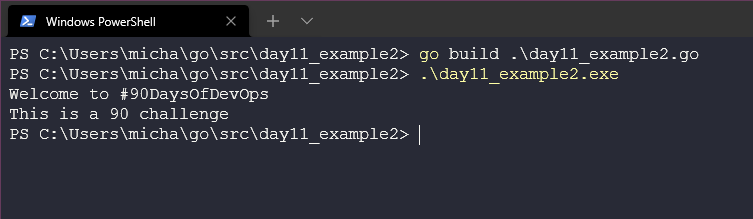
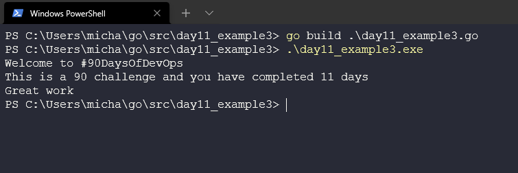

Prima di iniziare con gli argomenti di oggi, vorrei fare un enorme ringraziamento a [Techworld with Nana](https://www.youtube.com/watch?v=yyUHQIec83I) per questo fantastico e conciso viaggio  attraverso i fondamenti di Go.

Nel [Giorno 8](day08.md) abbiamo configurato il nostro ambiente, nel [Giorno 9](day09.md) abbiamo esaminato il codice di Hello #90DaysOfDevOps e nel [Giorno 10](day10.md) abbiamo esplorato il nostro spazio di lavoro Go e approfondito la compilazione ed esecuzione del codice.

Oggi esamineremo le Variabili, le Costanti e i Tipi di Dati mentre scriviamo un nuovo programma.

## Variabili e Costanti in Go

Cominciamo pianificando la nostra applicazione, penso che sarebbe una buona idea lavorare su un programma che ci dica quanti giorni ci sono rimasti nella nostra sfida #90DaysOfDevOps.

La prima cosa da considerare qui è che, mentre stiamo costruendo la nostra app, diamo il benvenuto ai partecipanti e forniamo loro un feedback sul numero di giorni che hanno completato, potremmo usare il termine #90DaysOfDevOps molte volte all'interno del programma. Questo è un ottimo caso d'uso per rendere #90DaysOfDevOps una variabile all'interno del nostro programma.

- Le Variabili vengono utilizzate per memorizzare valori.
- Sono come piccole scatole con le nostre informazioni o valori salvati.
- Possiamo poi utilizzare questa variabile in tutto il programma, il che è utile anche perché se questa sfida o variabile cambia, dovremo modificarla solo in un unico punto. Ciò significa che potremmo tradurre questa sfida in altre sfide che abbiamo nella comunità semplicemente cambiando il valore di quella variabile.

Per dichiararla nel nostro programma Go, definiamo un valore utilizzando una **parola chiave** per le variabili. Questa agirà all'interno del blocco `func main` del codice che vedrete più avanti. Puoi trovare ulteriori informazioni sulle [parole chiave](https://go.dev/ref/spec#Keywords) qui.

Assicurarti che i nomi delle tue variabili siano descrittivi. Se dichiari una variabile, devi utilizzarla, altrimenti otterrai un errore, ciò serve a evitare *dead code*, cioè codice che non viene mai utilizzato. Lo stesso vale per i packages non utilizzati.

```golang
var sfida = "#90DaysOfDevOps"
```

Con il valore sopra definito e utilizzato come vedremo nel prossimo frammento di codice, puoi vedere dall'output qui sotto che abbiamo utilizzato una variabile.

```golang
package main

import "fmt"

func main() {
    var challenge = "#90DaysOfDevOps"
    fmt.Println("Welcome to", challenge, "")
}
```

Puoi trovare il frammento di codice sopra in [day11_example1.go](Go/day11_example1.go)

Vedrai quindi dal seguente output che abbiamo compilato il nostro codice con l'esempio sopra e abbiamo ottenuto il risultato mostrato sotto.


Sappiamo anche che la nostra sfida è di 90 giorni, almeno per questa sfida, ma in futuro potrebbe essere di 100 giorni, quindi vogliamo definire una variabile che ci aiuti anche in questo caso. Tuttavia, per il nostro programma, vogliamo definirlo come una costante. Le costanti sono come le variabili, tranne che il loro valore non può essere cambiato nel codice (possiamo comunque creare una nuova app in con questo stesso codice e cambiare solo la costante, ma questo 90 non cambierà mentre stiamo eseguendo la nostra applicazione).

Aggiungiamo `const` al nostro codice e aggiungiamo un'altra riga di codice per stampare questo.

```golang
package main

import "fmt"

func main() {
    var challenge = "#90DaysOfDevOps"
    const daystotal = 90

    fmt.Println("Welcome to", challenge, "")
    fmt.Println("This is a", daystotal, "challenge")
}
```

Puoi trovare questo frammento di codice in [day11_example2.go](Go/day11_example2.go)

Se quindi ripetiamo nuovamente il processo di `go build` ed eseguiamo, vedrai il risultato qui sotto.



Infine, e questo non sarà la fine del nostro programma, torneremo su questo argomento nel [Giorno 12](day12.md) per aggiungere altre funzionalità. Adesso vogliamo aggiungere un'altra variabile per il numero di giorni in cui abbiamo completato la sfida.

Qui sotto ho aggiunto la variabile `dayscomplete` con il numero di giorni completati.

```golang
package main

import "fmt"

func main() {
    var challenge = "#90DaysOfDevOps"
    const daystotal = 90
    var dayscomplete = 11

    fmt.Println("Welcome to", challenge, "")
    fmt.Println("This is a", daystotal, "challenge and you have completed", dayscomplete, "days")
    fmt.Println("Great work")
}
```

Puoi trovare quest'altro frammento di codice in [day11_example3.go](Go/day11_example3.go)

Eseguiamo nuovamente il processo di `go build` o puoi semplicemente usare `go run`.



Ecco alcuni altri esempi che ho utilizzato per rendere il codice più leggibile e modificabile. Fino ad ora abbiamo utilizzato `Println`, ma possiamo semplificare il codice usando `Printf` con `%v`, che significa che definiamo le nostre variabili, in ordine, alla fine della riga di codice. Utilizziamo anche `\n` per un'interruzione di riga.

Sto usando `%v` perché utilizza un valore predefinito, ma ci sono altre opzioni che puoi trovare nella [documentazione del pacchetto fmt](https://pkg.go.dev/fmt) qui puoi trovare il codice di esempio [day11_example4.go](Go/day11_example4.go)

Le variabili possono anche essere definite in un formato più semplice nel tuo codice. Invece di definire che si tratta di una `var` e del `tipo`, puoi codificarlo come segue per ottenere la stessa funzionalità, ma con un aspetto più pulito e semplice per il tuo codice. Questo funzionerà solo per le variabili e non per le costanti.

```golang
func main() {
    challenge := "#90DaysOfDevOps"
    const daystotal = 90
```

## Tipi di Dati

Negli esempi precedenti, non abbiamo definito il tipo delle variabili, perché possiamo assegnare un valore e Go è abbastanza intelligente da capire qual è il tipo o almeno può dedurlo in base al valore che hai memorizzato. Tuttavia, se vogliamo una modalità di input utente, richiederemo un tipo specifico.

Abbiamo usato Stringhe e Numeri Interi nel nostro codice finora. Integers per il numero di giorni e le stringhe per il nome della sfida.

È importante notare che ogni tipo di dato può fare cose diverse e si comporta in modo diverso. Ad esempio, gli interi possono essere moltiplicati, mentre le stringhe no.

Esistono quattro categorie

- **Tipo base**: Numeri, stringhe e booleani rientrano in questa categoria.
- **Tipo aggregato**: Array e strutture rientrano in questa categoria.
- **Tipo di riferimento**: Puntatori, slices, mappe, funzioni e canali rientrano in questa categoria.
- **Tipo interfaccia**

Il tipo di dato è un concetto importante nella programmazione. Il tipo di dato specifica la dimensione e il tipo dei valori delle variabili.

Go è un linguaggio con tipizzazione statica, il che significa che una volta che un tipo di variabile è stato definito, essa può memorizzare solo dati di quel tipo.

Go ha tre tipi di dati di base:

- **bool**: rappresenta un valore booleano e può essere true o false.
- **Numerici**: rappresentano tipi interi, valori floating-point e tipi complessi.
- **string**: rappresenta un valore stringa.

Ho trovato questa risorsa molto dettagliata sui tipi di dati [Golang by example](https://golangbyexample.com/all-data-types-in-golang-with-examples/)

Suggerirei anche [Techworld with Nana](https://www.youtube.com/watch?v=yyUHQIec83I&t=2023s) che copre in dettaglio molti aspetti dei tipi di dati in Go.

Se abbiamo bisogno di definire un tipo nella nostra variabile, possiamo farlo in questo modo:

```golang
var TwitterHandle string
var DaysCompleted uint
```

Poiché Go implica le variabili dove è stato assegnato un valore, possiamo stampare quei valori con quanto segue:

```golang
fmt.Printf("challenge is %T, daystotal is %T, dayscomplete is %T\n", conference, daystotal, dayscomplete)
```

Esistono molti tipi diversi di interi e numeri in virgola mobile, i link sopra li copriranno in dettaglio.

- **int**: numeri interi
- **unint**: numeri interi positivi
- **tipi floating-point**: numeri con componente decimale

## Risorse

- [StackOverflow 2021 Developer Survey](https://insights.stackoverflow.com/survey/2021)
- [Why we are choosing Golang to learn](https://www.youtube.com/watch?v=7pLqIIAqZD4&t=9s)
- [Jake Wright - Learn Go in 12 minutes](https://www.youtube.com/watch?v=C8LgvuEBraI&t=312s)
- [Techworld with Nana - Golang full course - 3 hours 24 mins](https://www.youtube.com/watch?v=yyUHQIec83I)
- [**NOT FREE** Nigel Poulton Pluralsight - Go Fundamentals - 3 hours 26 mins](https://www.pluralsight.com/courses/go-fundamentals)
- [FreeCodeCamp - Learn Go Programming - Golang Tutorial for Beginners](https://www.youtube.com/watch?v=YS4e4q9oBaU&t=1025s)
- [Hitesh Choudhary - Complete playlist](https://www.youtube.com/playlist?list=PLRAV69dS1uWSR89FRQGZ6q9BR2b44Tr9N)

Ora passiamo ad aggiungere una funzionalità di input utente al nostro programma in modo che ci venga chiesto quanti giorni sono stati completati.

Ci vediamo al [Giorno 12](day12.md).
