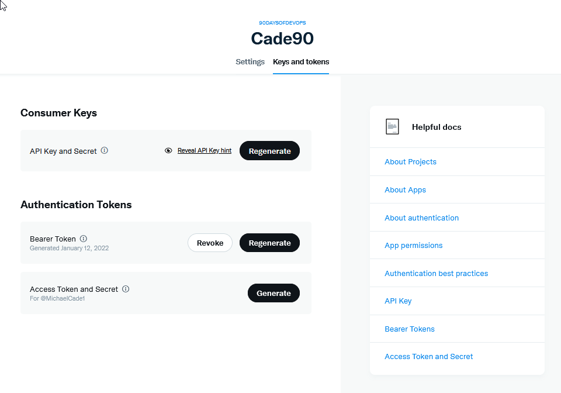

## Twitta i tuoi progressi con la nostra nuova app

Nell'ultimo giorno di esplorazione di questo linguaggio di programmazione, abbiamo solo scalfito la superficie del linguaggio, ma è proprio all'inizio che penso che dobbiamo interessarci ed entusiasmarci ad approfondire l'argomento.

Negli ultimi giorni, abbiamo preso una piccola idea per un'applicazione e abbiamo aggiunto funzionalità ad essa, in questa sessione voglio sfruttare quei packages di cui abbiamo parlato e creare la funzionalità per la nostra app, non solo di fornire un aggiornamento dei tuoi progressi sullo schermo, ma anche per inviare un tweet con i dettagli della sfida e del tuo stato.

## Aggiunta della possibilità di twittare i tuoi progressi

La prima cosa da fare è configurare l'accesso alla API di Twitter da sviluppatore affinché funzioni.

Vai alla [Piattaforma sviluppatori Twitter](https://developer.twitter.com) e accedi con il tuo account Twitter. Una volta dentro, dovresti vedere qualcosa di simile a quanto segue, ma senza l'app che ho già creato.


Da qui potresti anche voler richiedere un diverso tipo di account, ciò potrebbe richiedere del tempo, ma è stato molto veloce per me.

Successivamente, selezioniamo Projects & Apps e creiamo la nostra App. I limiti dipendono dall'accesso dell'account che hai, con "free" hai solo un'app ID, mentre con "basic" puoi averne 2 e con "pro" ne avresti 3 (ndt: basic e pro sono ad abbonamento mensile).


Dai un nome alla tua applicazione.


Ti verranno quindi forniti questi token API, devi salvarli in un luogo sicuro. (Io ho eliminato questa app in seguito) Ne avremo bisogno più tardi con la nostra applicazione Go.


Ora abbiamo creato la nostra app, (ho dovuto cambiare il nome dell'app poiché quello nella schermata sopra era già in uso, questi nomi devono essere univoci).


Le chiavi che abbiamo raccolto prima sono note come nostre chiavi consumatore e avremo anche bisogno del nostro token di accesso. Possiamo raccogliere queste informazioni utilizzando la scheda "Keys & Tokens".



Bene, abbiamo finito nel portale sviluppatori di Twitter per ora. Assicurati di conservare al sicuro le tue chiavi perché ne avremo bisogno più tardi.

## Go Twitter Bot

Ricorda che il codice da cui partiamo all'interno della nostra applicazione è [day13_example1](Go/day13_example1.go), ma prima dobbiamo verificare se abbiamo il codice corretto per inviare un tweet.

Dobbiamo ora pensare al codice per ottenere il nostra output o messaggio su Twitter sotto forma di un tweet. Utilizzeremo [go-twitter](https://github.com/dghubble/go-twitter). Si tratta di una libreria client di Go per l'API di Twitter.

Per testare questo prima di inserirlo nella nostra applicazione principale, ho creato una nuova directory nella nostra cartella `src` chiamata "go-twitter-bot", ho eseguito il comando `go mod init github.com/michaelcade/go-Twitter-bot` nella cartella che ha creato un file `go.mod` e quindi possiamo iniziare a scrivere il nostro nuovo main.go e testare questo.

Ora abbiamo bisogno di quei token, chiavi segreti che abbiamo raccolto dal portale sviluppatori di Twitter. Li imposteremo come variabili d'ambiente. Questo dipenderà dal sistema operativo che stai usando:

Ho ricevuto alcune domande relative alle variabili d'ambiente, quindi ecco un post sul blog che va più in dettaglio, in modo da poter capire cosa sta accadendo: [How To Set Environment Variables](https://www.twilio.com/blog/2017/01/how-to-set-environment-variables.html)

Windows

```zsh
set CONSUMER_KEY
set CONSUMER_SECRET
set ACCESS_TOKEN
set ACCESS_TOKEN_SECRET
```

Linux / macOS

```bash
export CONSUMER_KEY
export CONSUMER_SECRET
export ACCESS_TOKEN
export ACCESS_TOKEN_SECRET
```

A questo punto, puoi dare un'occhiata a [day13_example2](Go/day13_example2.go) al codice, ma vedrai che stiamo utilizzando una struttura per definire le nostre chiavi e token segreti.

Abbiamo quindi una `func` per analizzare queste credenziali e stabilire la connessione con l'API di Twitter.

Successivamente, in base al successo, invieremo un tweet.

```golang
package main

import (
    // altre importazioni
    "fmt"
    "log"
    "os"

    "github.com/dghubble/go-twitter/twitter"
    "github.com/dghubble/oauth1"
)

// Credentials memorizza tutti i nostri token di accesso/consumatore
// e le chiavi segrete necessarie per l'autenticazione dell'API REST di Twitter.
type Credentials struct {
    ConsumerKey       string
    ConsumerSecret    string
    AccessToken       string
    AccessTokenSecret string
}

// getClient è una funzione di supporto che restituirà un client di Twitter
// che possiamo successivamente usare per inviare tweet o per trasmettere nuovi tweet.
// Questo accetta un puntatore a una struttura Credential che conterrà
// tutto il necessario per l'autenticazione e restituirà un puntatore a un client di Twitter
// o un errore.
func getClient(creds *Credentials) (*twitter.Client, error) {
    // Passa la tua chiave consumatore (API Key) e il tuo Consumer Secret (API Secret)
    config := oauth1.NewConfig(creds.ConsumerKey, creds.ConsumerSecret)
    // Passa il tuo Access Token e il tuo Access Token Secret
    token := oauth1.NewToken(creds.AccessToken, creds.AccessTokenSecret)

    httpClient := config.Client(oauth1.NoContext, token)
    client := twitter.NewClient(httpClient)

    // Verifica le credenziali
    verifyParams := &twitter.AccountVerifyParams{
        SkipStatus:   twitter.Bool(true),
        IncludeEmail: twitter.Bool(true),
    }

    // possiamo recuperare l'utente e verificare se le credenziali
    // che abbiamo usato ci consentono di eff ettuare l'accesso!
    user, _, err := client.Accounts.VerifyCredentials(verifyParams)
    if err != nil {
        return nil, err
    }

    log.Printf("ACCOUNT:\n%+v\n", user)
    return client, nil
}

func main() {
    fmt.Println("Go-Twitter Bot v0.01")
    creds := Credentials{
        AccessToken:       os.Getenv("ACCESS_TOKEN"),
        AccessTokenSecret: os.Getenv("ACCESS_TOKEN_SECRET"),
        ConsumerKey:       os.Getenv("CONSUMER_KEY"),
        ConsumerSecret:    os.Getenv("CONSUMER_SECRET"),
    }

    client, err := getClient(&creds)
    if err != nil {
        log.Println("Error getting Twitter Client")
        log.Println(err)
    }

    tweet, resp, err := client.Statuses.Update("A Test Tweet from the future, testing a #90DaysOfDevOps Program that tweets, tweet tweet", nil)
    if err != nil {
        log.Println(err)
    }
    log.Printf("%+v\n", resp)
    log.Printf("%+v\n", tweet)
}
```

Questo codice ti darà un errore in base a ciò che sta accadendo oppure avrà successo e invierà un tweet con il messaggio indicato nel codice.

## Accoppiare i due insieme - Go-Twitter-Bot + La nostra App

Ora dobbiamo unire questi due nel nostro `main.go`. Sono sicuro che qualcuno là fuori sta urlando che c'è un modo migliore per farlo, per favore commenta se puoi avere più di un file `.go` in un progetto, potrebbe avere senso, ma questo funziona.

Puoi vedere il codice combinato [day13_example3](Go/day13_example3.go), ma lo mostrerò anche di seguito.

```golang
package main

import (
    // altre importazioni
    "fmt"
    "log"
    "os"

    "github.com/dghubble/go-twitter/twitter"
    "github.com/dghubble/oauth1"
)

// Credentials memorizza tutti i nostri token di accesso/consumatore
// e le chiavi segrete necessarie per l'autenticazione dell'API REST di Twitter.
type Credentials struct {
    ConsumerKey       string
    ConsumerSecret    string
    AccessToken       string
    AccessTokenSecret string
}

// getClient è una funzione di supporto che restituirà un client di Twitter
// che possiamo successivamente usare per inviare tweet o per trasmettere nuovi tweet.
// Questo accetta un puntatore a una struttura Credential che conterrà
// tutto il necessario per l'autenticazione e restituirà un puntatore a un client di Twitter
// o un errore.
func getClient(creds *Credentials) (*twitter.Client, error) {
    // Passa la tua chiave consumatore (API Key) e il tuo Consumer Secret (API Secret)
    config := oauth1.NewConfig(creds.ConsumerKey, creds.ConsumerSecret)
    // Passa il tuo Access Token e il tuo Access Token Secret
    token := oauth1.NewToken(creds.AccessToken, creds.AccessTokenSecret)

    httpClient := config.Client(oauth1.NoContext, token)
    client := twitter.NewClient(httpClient)

    // Verifica le credenziali
    verifyParams := &twitter.AccountVerifyParams{
        SkipStatus:   twitter.Bool(true),
        IncludeEmail: twitter.Bool(true),
    }

    // possiamo recuperare l'utente e verificare se le credenziali
    // che abbiamo usato ci consentono di effettuare l'accesso!
    user, _, err := client.Accounts.VerifyCredentials(verifyParams)
    if err != nil {
        return nil, err
    }

    log.Printf("ACCOUNT:\n%+v\n", user)
    return client, nil
}

func main() {
    creds := Credentials{
        AccessToken:       os.Getenv("ACCESS_TOKEN"),
        AccessTokenSecret: os.Getenv("ACCESS_TOKEN_SECRET"),
        ConsumerKey:       os.Getenv("CONSUMER_KEY"),
        ConsumerSecret:    os.Getenv("CONSUMER_SECRET"),
    }

    {
        const DaysTotal int = 90
        var remainingDays uint = 90
        challenge := "#90DaysOfDevOps"

        fmt.Printf("Welcome to the %v challenge.\nThis challenge consists of %v days\n", challenge, DaysTotal)

        var TwitterName string
        var DaysCompleted uint

        // chiediamo l'input all'utente
        fmt.Println("Enter Your Twitter Handle: ")
        fmt.Scanln(&TwitterName)

        fmt.Println("How many days have you completed?: ")
        fmt.Scanln(&DaysCompleted)

        // calcola i giorni rimanenti
        remainingDays = remainingDays - DaysCompleted

        //fmt.Printf("Thank you %v for taking part and completing %v days.\n", TwitterName, DaysCompleted)
        //fmt.Printf("You have %v days remaining for the %v challenge\n", remainingDays, challenge)
        // fmt.Println("Good luck")

        client, err := getClient(&creds)
        if err != nil {
            log.Println("Error getting Twitter Client, this is expected if you did not supply your Twitter API tokens")
            log.Println(err)
        }

        message := fmt.Sprintf("Hey I am %v I have been doing the %v for %v days and I have %v Days left", TwitterName, challenge, DaysCompleted, remainingDays)
        tweet, resp, err := client.Statuses.Update(message, nil)
        if err != nil {
            log.Println(err)
        }
        log.Printf("%+v\n", resp)
        log.Printf("%+v\n", tweet)
    }

}
```

Il risultato di questo dovrebbe essere un tweet, ma se non hai fornito le tue variabili d'ambiente, dovresti ottenere un errore come quello mostrato di seguito.


Una volta risolto ciò o se scegli di non autenticarti con Twitter, puoi utilizzare il codice con cui abbiamo terminato ieri. L'output del terminale in caso di successo sarà simile a questo:


Il tweet risultante dovrebbe assomigliare a qualcosa del genere:


## Come compilare per più sistemi operativi

Ora voglio rispondere alla domanda: "Come compilare per più sistemi operativi?" La cosa fantastica di Go è che può compilare facilmente per molti sistemi operativi diversi. Puoi ottenere una lista completa eseguendo il comando seguente:

```bash
go tool dist list
```

Finora, l'utilizzo dei nostri comandi `go build` è ottimo e utilizzerà le variabili d'ambiente `GOOS` e `GOARCH` per determinare la macchina host e per quale sistema operativo deve essere compilato. Ma possiamo anche creare altre build utilizzando il codice seguente come esempio.

```bash
GOARCH=amd64 GOOS=darwin go build -o ${BINARY_NAME}_0.1_darwin main.go
GOARCH=amd64 GOOS=linux go build -o ${BINARY_NAME}_0.1_linux main.go
GOARCH=amd64 GOOS=windows go build -o ${BINARY_NAME}_0.1_windows main.go
GOARCH=arm64 GOOS=linux go build -o ${BINARY_NAME}_0.1_linux_arm64 main.go
GOARCH=arm64 GOOS=darwin go build -o ${BINARY_NAME}_0.1_darwin_arm64 main.go
```

Questo ti darà poi le build nella tua directory per tutte le piattaforme sopra indicate. Puoi quindi prendere tutto ciò e creare un makefile per compilare queste build ogni volta che aggiungi nuove funzionalità al tuo codice. Qui ho anche incluso il [makefile](Go/makefile).

Questo è ciò che ho usato per creare le release che ora puoi vedere nel [repository](https://github.com/MichaelCade/90DaysOfDevOps/releases).

## Risorse

- [StackOverflow 2021 Developer Survey](https://insights.stackoverflow.com/survey/2021)
- [Why we are choosing Golang to learn](https://www.youtube.com/watch?v=7pLqIIAqZD4&t=9s)
- [Jake Wright - Learn Go in 12 minutes](https://www.youtube.com/watch?v=C8LgvuEBraI&t=312s)
- [Techworld with Nana - Golang full course - 3 hours 24 mins](https://www.youtube.com/watch?v=yyUHQIec83I)
- [**NOT FREE** Nigel Poulton Pluralsight - Go Fundamentals - 3 hours 26 mins](https://www.pluralsight.com/courses/go-fundamentals)
- [FreeCodeCamp - Learn Go Programming - Golang Tutorial for Beginners](https://www.youtube.com/watch?v=YS4e4q9oBaU&t=1025s)
- [Hitesh Choudhary - Complete playlist](https://www.youtube.com/playlist?list=PLRAV69dS1uWSR89FRQGZ6q9BR2b44Tr9N)
- [A great repo full of all things DevOps & exercises](https://github.com/bregman-arie/devops-exercises)
- [GoByExample - Example based learning](https://gobyexample.com/)
- [go.dev/tour/list](https://go.dev/tour/list)
- [go.dev/learn](https://go.dev/learn/)

Questo conclude il linguaggio di programmazione per 7 giorni! Ci sono ancora molte altre cose che potrebbero essere affrontate e spero tu sia riuscito a proseguire attraverso i contenuti sopra e a comprendere alcuni degli altri aspetti del linguaggio di programmazione Go.

Ora passiamo alla nostra attenzione su Linux e alcune delle fondamentali che dovremmo tutti conoscere lì.

Ci vediamo il [Giorno 14](day14.md).
