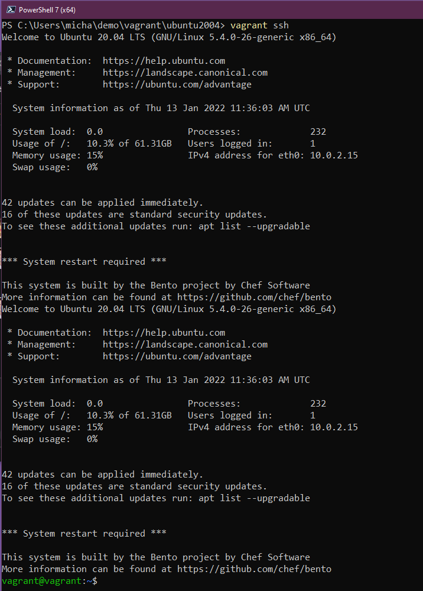

## La Visione D'Insieme: DevOps e Linux

Linux e DevOps condividono culture e prospettive molto simili; entrambi sono concentrati sulla personalizzazione e la scalabilità. Entrambi questi aspetti di Linux sono particolarmente importanti per DevOps.

Molte tecnologie iniziano su Linux, specialmente se sono correlate allo sviluppo software o alla gestione dell'infrastruttura.

Inoltre, molti progetti open source, specialmente gli strumenti DevOps, sono stati progettati per funzionare su Linux fin dall'inizio.

Dal punto di vista di DevOps o di qualsiasi ruolo operativo, direi che ti troverai principalmente a fare esperienza con Linux. C'è spazio anche per WinOps, ma nella maggior parte dei casi ti troverai ad amministrare e distribuire server Linux.

Ho usato Linux quotidianamente per diversi anni, ma il mio computer desktop di riferimento è sempre stato macOS o Windows. Tuttavia, quando sono passato al ruolo di Cloud Native in cui mi trovo adesso, ho deciso di passare completamente a Linux per il mio laptop, anche se avevo ancora bisogno di Windows per le applicazioni legate al lavoro e molta della mia attrezzatura audio e video non funziona su Linux. Mi stavo forzando a usare un desktop Linux a tempo pieno per comprendere meglio molte delle cose su cui lavoreremo nei prossimi 7 giorni.

## Per Iniziare

Non sto suggerendo di fare la stessa cosa che ho fatto io, perché ci sono opzioni più facili e meno distruttive, ma devo dire che occuparsene passo a tempo pieno ti costringe a imparare più velocemente come far funzionare le cose su Linux.

Per la maggior parte di questi 7 giorni, prevedo di avviare una macchina virtuale in Virtual Box sul mio computer Windows. Avvierò anche una versione desktop di una distribuzione Linux, mentre molti dei server Linux che amministrerai probabilmente saranno server senza GUI e tutto sarà basato su shell. Tuttavia, come ho detto all'inizio, molti degli strumenti di cui ci interessiamo in questi 90 giorni sono nati su Linux e ti incoraggio fortemente a esplorare il desktop Linux per ottenere anche l'esperienza di apprendimento.

Per il resto di questo post, ci concentreremo su come ottenere una macchina virtuale desktop Ubuntu funzionante nel nostro ambiente Virtual Box. Potremmo semplicemente scaricare [Virtual Box](https://www.virtualbox.org/) e prendere l'ultima [ISO di Ubuntu](https://ubuntu.com/download) dai siti linkati e procedere a creare il nostro ambiente desktop, ma non sarebbe molto DevOps, vero?

Un'altra buona ragione per usare la maggior parte delle distribuzioni Linux è che sono gratuite e open-source. Stiamo scegliendo Ubuntu perché è probabilmente la distribuzione più utilizzata, a parte i dispositivi mobili e i server di RedHat Enterprise. Potrei sbagliarmi, ma con CentOS e la sua storia, scommetto che Ubuntu è in cima alla lista ed è super semplice.

## Introduzione a HashiCorp Vagrant

Vagrant è un'utilità CLI che gestisce il ciclo di vita delle tue macchine virtuali. Possiamo usare Vagrant per avviare e spegnere macchine virtuali su molte piattaforme diverse, incluse vSphere, Hyper-V, Virtual Box e anche Docker. Ha anche altri provider, ma qui ci limiteremo a Virtual Box.

La prima cosa da fare è installare Vagrant sulla nostra macchina; sulla pagina dei download troverai elencati tutti i sistemi operativi tra cui scegliere. [HashiCorp Vagrant](https://www.vagrantup.com/downloads) Sto usando Windows, quindi ho preso il file binario per il mio sistema e l'ho installato sulla mia macchina.

In seguito, dobbiamo anche installare [Virtual Box](https://www.virtualbox.org/wiki/Downloads). Anche questo può essere installato su molti sistemi operativi diversi, e una buona ragione per scegliere Vagrant e Virtual Box, è perché se ci sono versioni per Windows, macOS e Linux.

Entrambe le installazioni sono abbastanza semplici ed entrambi i programmi sono supportati da ottime community, quindi non esitare a chiedere aiuto se hai problemi, posso cercare di aiutarti anch'io.

> Se stai usando Mac con processore serie M, ti consiglio di usare [multiplass]([url](https://multipass.run/)) al posto di Vagrant e VirtualBox. (riferimento: https://github.com/MichaelCade/90DaysOfDevOps/issues/365)

## Il nostro primo VAGRANTFILE

Il VAGRANTFILE descrive il tipo di macchina che vogliamo avviare. Definisce anche la configurazione e la gestione di questa macchina.

Per salvare e organizzare questi VAGRANTFILE, tendo a metterli nelle loro cartelle nel mio spazio di lavoro. Puoi vedere qui sotto come appare sul mio sistema. Se tutto va bene seguendo questo esempio vedrai quanto sia facile con Vagrant avviare sistemi diversi. È anche ottimo distro hopping per i desktop Linux.


Diamo un'occhiata a quel VAGRANTFILE e vediamo cosa stiamo creando.

```
Vagrant.configure("2") do |config|

  config.vm.box = "chenhan/ubuntu-desktop-20.04"

  config.vm.provider :virtualbox do |v|

   v.memory  = 8096

   v.cpus    = 4

   v.customize ["modifyvm", :id, "--vram", "128"]

end

end
```

Questo è un VAGRANTFILE molto semplice. Stiamo dicendo che vogliamo una "box" specifica, una box che potrebbe essere una immagine pubblica o una build privata del sistema che stai cercando. Puoi trovare una lunga lista di "boxes" disponibili pubblicamente qui nel [catalogo pubblico delle Vagrant boxes](https://app.vagrantup.com/boxes/search).

La riga successiva dice che vogliamo usare un provider specifico, in questo caso è `VirtualBox`. Definiamo anche la memoria della nostra macchina a `8GB` e il numero di CPU a `4`. La mia esperienza mi dice che potresti voler aggiungere anche la seguente riga se incontri problemi di visualizzazione. Questo imposterà la memoria video a quanto desideri, io la porterei fino a `128MB`, ma dipende dal tuo sistema.

```
v.customize ["modifyvm", :id, "--vram", ""]
```

Ho anche messo una copia di questo file Vagrant specifico nella [Cartella Linux](Linux/VAGRANTFILE)

## Configurazione del nostro Desktop Linux

Siamo ora pronti per far partire la nostra prima macchina; nel terminale del nostro computer. Nel mio caso, sto usando PowerShell sul mio computer Windows. Vai alla cartella dei tuoi progetti e dove troverai il tuo VAGRANTFILE. Una volta lì, digita il comando `vagrant up` e se va tutto bene vedrai qualcosa del genere.


Un'altra cosa da aggiungere è che la rete verrà impostata su `NAT` sulla tua macchina virtuale. In questo momento non abbiamo bisogno di conoscere NAT ma ho in programma una sessione completa in cui parleremo di Networking. Sappi che è il modo più semplice per collegare una macchina alla tua rete domestica ed è anche la modalità di networking predefinita su Virtual Box. Puoi trovare ulteriori informazioni nella [documentazione di Virtual Box](https://www.virtualbox.org/manual/ch06.html#network_nat)

Una volta completato `vagrant up`, ora possiamo utilizzare `vagrant ssh` per accedere direttamente al terminale della nostra nuova VM.



È qui che esploreremo la maggior parte delle cose nei prossimi giorni, ma voglio anche approfondire alcune personalizzazioni per la tua stazione di lavoro da sviluppatore che semplificano molto la vita quando si usa questo sistema quotidianamente.

Solo per confermare, in Virtual Box dovresti vedere il prompt di login quando selezioni la tua VM.


Ah, e se sei arrivato fin qui e ti stai chiedendo "QUAL È IL NOME UTENTE E LA PASSWORD?"

- Nome Utente = vagrant

- Password = vagrant

Domani daremo uno sguardo a alcuni comandi e a cosa fanno. Il terminale sarà il posto dove farai accadere tutto.

## Risorse

- [Learn the Linux Fundamentals - Part 1](https://www.youtube.com/watch?v=kPylihJRG70)
- [Linux for hackers (don't worry you don't need to be a hacker!)](https://www.youtube.com/watch?v=VbEx7B_PTOE)

Condividerò molte risorse man mano che procediamo e, come per le risorse su Go, di solito sono gratuite in modo che tutti possiamo partecipare e imparare insieme.

Come già detto, nella prossima sessione daremo uno sguardo ai comandi che potremmo usare quotidianamente nei nostri ambienti Linux.

Ci vediamo il [Giorno 15](day15.md)