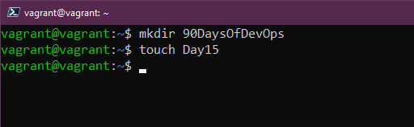
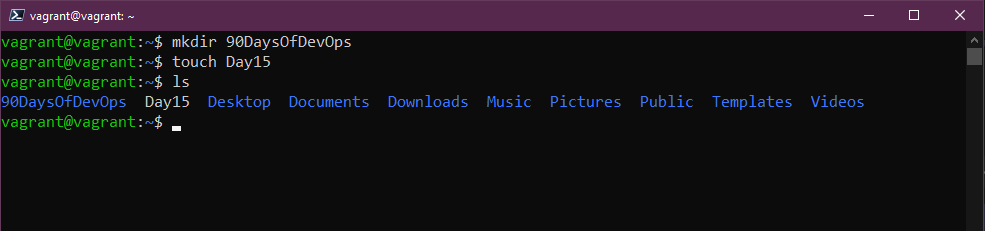
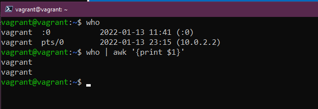

## Comandi Linux per DevOps (e anche per tutti)

Avevo menzionato [ieri](day14.md) che avremmo passato molto tempo nel terminale usando alcuni comandi per fare determinate cose.

Ho anche detto possiamo usare `vagrant ssh` per accedere alla nostra macchina VM creata con Vagrant. Per farlo dovrai posizionarti nella stessa directory da cui l'abbiamo creata.

Per SSH non avrai bisogno di nome utente e password, ne avrai bisogno solo se decidi di accedere alla console di Virtual Box.

Ecco come dovrebbe apparire il terminale:


## Comandi

Non posso trattare tutti i comandi in questa sezione, ci sono pagine e pagine di documentazione che se ne occupano, ma se sei nel terminale e ti serve solo capire le opzioni per un comando, abbiamo le pagine `man`, abbreviazione di manuale. Possiamo usarlo per esaminare ciascuno dei comandi di cui parleremo durante questo post per scoprire ulteriori opzioni di comandi. Possiamo eseguire `man man`, che ti fornirà l'aiuto per le pagine del manuale. Per uscire dalle pagine di manuale dovresti premere il tasto `q`.


`sudo` Se sei familiare con Windows e il comando `esegui come amministratore`, puoi pensare a `sudo` come molto simile. Quando esegui un comando passando per `sudo``, lo eseguirai come `root` e ti chiederà la password prima di eseguire il comando.


Per operazioni occasionali come installare applicazioni o servizi, potresti aver bisogno di `sudo command`, ma cosa fare se hai diversi compiti da gestire e vuoi operare come `sudo` per un po'? Puoi usare `sudo su`, di nuovo molto simile a `sudo`: una volta inserito, ti verrà richiesta la password di `root`. In una VM di test come la nostra, va bene, ma sarebbe molto rischioso utilizzare costantemente `root`, possono verificarsi problemi gravi. Per uscire dalla posizione `sudo su`, basta digitare `exit`.


Trovo utile usare `clear` tutto il tempo, il comando `clear` fa esattamente ciò che dice: cancella tutti i comandi precedenti sullo schermo, posizionando il prompt in alto e dandoti un ambiente di lavoro pulito. Nel prompt dei comandi di Windows, penso che si chiami `cls`.


Ora guardiamo alcuni comandi con cui possiamo effettivamente creare cose nel nostro sistema e quindi visualizzarle nel nostro terminale, innanzitutto `mkdir` che ci permetterà di creare una cartella nel nostro sistema. Con il seguente comando, possiamo creare una cartella nella nostra directory home chiamata Day15 `mkdir Day15`


Con `cd` possiamo cambiare la directory, quindi per spostarci nella nostra nuova directory appena creata possiamo farlo con `cd Day15`. Anche il tasto tab può essere usato per completare il nome della directory. Se vogliamo tornare al punto di partenza possiamo usare `cd ..`


`rmdir` ci permette di rimuovere la directory, se eseguiamo `rmdir Day15` la cartella verrà rimossa (nota che questo funzionerà solo se la cartella è vuota)


Sono sicuro che tutti abbiamo navigato nei meandri del nostro file system approdando in una directory senza sapere dove sia. `pwd` ci dà la stampa della directory di lavoro, pwd, anche se sembra significare password, sta per ***p****rint* ***w****orking* ***d****irectory*.


Sappiamo come creare cartelle e directory, ma come creiamo i file? Possiamo creare file usando il comando `touch`, se eseguissimo `touch Day15` questo creerebbe un file. Ignora `mkdir`, lo vedremo di nuovo più avanti.



`ls` Posso scommettere la mia casa su questo, userai questo comando moltissime volte, `ls` elenca tutti i file e le cartelle contenuti nella directory corrente. Vediamo se possiamo vedere il file che abbiamo appena creato.



Come possiamo trovare file sul nostro sistema Linux? `locate` ci permette di cercare nel nostro filesystem. Se usiamo `locate Day15` ci restituirà la posizione del file. Se sai che il file esiste ma ottieni un risultato vuoto, esegui `sudo updatedb` che indicizzerà tutti i file nel filesystem, quindi esegui nuovamente il comando `locate`. Se non hai `locate` disponibile, puoi installarlo usando questo comando `sudo apt install mlocate`


Cosa succede se vogliamo spostare file da una posizione all'altra? `mv` ci permette di spostare i file. Ad esempio, `mv Day15 90DaysOfDevOps` sposterà il tuo file nella cartella 90DaysOfDevOps.


Abbiamo spostato il nostro file, ma se volessimo rinominarlo ora in qualcos'altro? Possiamo farlo di nuovo usando il comando `mv`... CHE COSA!!!? sì, possiamo semplicemente usare `mv Day15 day15` per cambiarlo in maiuscolo o potremmo usare `mv day15 AnotherDay` per cambiarlo del tutto, ora usa `ls` per controllare il file.


Basta così, ora eliminiamo il nostro file e anche la nostra directory se ne abbiamo creata una. `rm` semplicemente `rm AnotherDay` rimuoverà il nostro file. Useremo anche molto `rm -R`, che funzionerà ricorsivamente attraverso una cartella o una posizione. Potremmo anche usare `rm -R -f` per forzare la rimozione di tutti quei file. Spoiler: se esegui `rm -R -f /` aggiungi `sudo` e potrai dire addio al tuo file system...!


Abbiamo guardato come spostare i file, ma se voglio solo copiare file da una cartella all'altra, è molto simile al comando `mv` ma usiamo `cp` quindi possiamo ora dire `cp Day15 Desktop`


Abbiamo creato cartelle e file ma non abbiamo inserito alcun contenuto nella nostra cartella, possiamo aggiungere contenuti in diversi modi, ma un modo semplice è `echo`, possiamo anche usare `echo` per stampare molte cose nel nostro terminale, io uso `echo` molto spesso per stampare le variabili di sistema per sapere se sono impostate o meno. Possiamo usare `echo "Hello #90DaysOfDevOps" > Day15` e questo lo sostituirà al testo già presente nel nostro file. Possiamo anche aggiungere ulteriore testo a quello già contenuto dell nostro file usando `echo "I comandi sono divertenti!" >> Day15`


Un altro comando che userai molto! `cat`, abbreviazione di *concatenate*. Possiamo usare `cat Day15` per vedere il testo contenuto all'interno del file. Ottimo per leggere rapidamente i file di configurazione.


Se hai un file di configurazione lungo e complesso, e vuoi o devi trovare qualcosa rapidamente in quel file, anziché leggere ogni riga, `grep` è il tuo amico, ciò ci permetterà di cercare nel file una parola specifica usando `cat Day15 | grep "#90DaysOfDevOps"`


Se sei come me e usi spesso quel comando `clear` potresti perdere alcuni dei comandi eseguiti in precedenza, possiamo usare `history` per trovare tutti quei comandi eseguiti in precedenza. `history -c` rimuoverà la cronologia.

Quando esegui `history` e vuoi scegliere un comando specifico, puoi usare `!3` per scegliere il terzo comando nella lista.

Puoi anche usare `history | grep "Comando"` per cercare qualcosa di specifico.

Nei server, per risalire a quando è stato eseguito un comando, può essere utile aggiungere la data e l'ora a ciascun comando nel file di cronologia.

La seguente variabile di sistema controlla questo comportamento:

```
HISTTIMEFORMAT="%d-%m-%Y %T "
```

Puoi aggiungerlo facilmente al tuo bash_profile:

```
echo 'export HISTTIMEFORMAT="%d-%m-%Y %T "' >> ~/.bash_profile
```

È utile permettere al file di cronologia di crescere ulteriormente:

```
echo 'export HISTSIZE=100000' >> ~/.bash_profile
echo 'export HISTFILESIZE=10000000' >> ~/.bash_profile
```


Hai bisogno di cambiare la tua password? `passwd` ci permetterà di cambiarla. Nota che quando inserisci la tua password in questo modo e questa è nascosta, non verrà mostrata in `history`, tuttavia se il tuo comando ha `-p PASSWORD` questo sarà visibile nella tua `history`.


Potremmo anche voler aggiungere nuovi utenti al nostro sistema, possiamo farlo con `useradd`. Per aggiungere nuovi utenti occorre passare per `sudo`, possiamo aggiungere un nuovo utente con `sudo useradd NewUser`


Creare un gruppo richiede di nuovo `sudo` e possiamo usare `sudo groupadd DevOps` quindi se vogliamo aggiungere il nostro nuovo utente a quel gruppo possiamo farlo eseguendo `sudo usermod -a -G DevOps` `-a` è aggiungere e `-G` è il nome del gruppo.


Come possiamo aggiungere gli utenti al gruppo `sudo`, questa sarebbe un'occasione molto rara, ma per farlo sarebbe `usermod -a -G sudo NewUser`

### Autorizzazioni

lettura, scrittura ed esecuzione sono le autorizzazioni che abbiamo per tutti i nostri file e cartelle nel nostro sistema Linux.

Una lista completa:

- 0 = Nessuno `---`
- 1 = Solo esecuzione `--X`
- 2 = Solo scrittura `-W-`
- 3 = Scrittura ed esecuzione `-WX`
- 4 = Solo lettura `R--`
- 5 = Lettura ed esecuzione `R-X`
- 6 = Lettura e scrittura `RW-`
- 7 = Lettura, scrittura ed esecuzione `RWX`

Vedrai anche `777` o `775` e questi rappresentano gli stessi numeri della lista sopra, ma ognuno rappresenta **Utente - Gruppo - Tutti**

Diamo un'occhiata al nostro file. `ls -al Day15` puoi vedere i 3 gruppi menzionati sopra, utente e gruppo hanno lettura e scrittura ma tutti hanno solo lettura.


Possiamo cambiarlo usando `chmod` potresti trovarti a farlo se stai creando spesso binari sui tuoi sistemi e devi dare la possibilità di eseguire quei binari. `chmod 750 Day15` ora esegui `ls -al Day15` se vuoi farlo per un'intera cartella puoi usare `-R` per farlo in modo ricorsivo.


Cosa succede se vogliamo cambiare il proprietario del file? Possiamo usare `chown` per questa operazione, se volessimo cambiare il possesso del nostro `Day15` da utente `vagrant` a `NewUser` possiamo eseguire `sudo chown NewUser Day15` di nuovo `-R` può essere usato.

### Permessi

Lettura, scrittura ed esecuzione sono i permessi che abbiamo su tutti i nostri file e cartelle nel sistema Linux.

Una lista completa:

- 0 = Nessuno `---`
- 1 = Solo esecuzione `--X`
- 2 = Solo scrittura `-W-`
- 3 = Scrittura ed esecuzione `-WX`
- 4 = Solo lettura `R--`
- 5 = Lettura ed esecuzione `R-X`
- 6 = Lettura e scrittura `RW-`
- 7 = Lettura, scrittura ed esecuzione `RWX`

Vedrai anche `777` o `775` e questi rappresentano gli stessi numeri della lista sopra, ma ognuno rappresenta **Utente - Gruppo - Tutti**

Diamo un'occhiata al nostro file. `ls -al Day15` e vedrai i 3 gruppi menzionati sopra, *utente* e *gruppo* hanno lettura e scrittura ma *tutti* ha solo lettura.


I permessi possono essere cambiati utilizzando `chmod`; potresti trovarlo utile se stai creando frequentemente file binari sui tuoi sistemi e devi dare la possibilità di eseguirli. `chmod 750 Day15` e ora esegui `ls -al Day15`; se desideri eseguire questa operazione per una cartella intera, puoi usare `-R` per farlo in modo ricorsivo.


E per cambiare il proprietario del file? Possiamo usare `chown` per questa operazione; se volessimo cambiare la proprietà del nostro `Day15` dall'utente `vagrant` a `NewUser`, possiamo eseguire `sudo chown NewUser Day15`; ancora una volta, `-R` può essere usato in modo ricorsivo.


Un comando che incontrerai è `awk`, utile quando hai un output da cui vuoi estrarre dati specifici. Ad esempio, se eseguiamo `who`, otteniamo righe con informazioni, ma forse vogliamo solo i nomi. Possiamo eseguire `who | awk '{print $1}'` per ottenere solo un elenco di quella prima colonna.



Se desideri leggere flussi di dati dall'input standard, quindi generare ed eseguire linee di comando, cioè prendere l'output di un comando e passarlo come argomento di un altro comando, `xargs` è uno strumento utile per questo caso d'uso. Se per esempio voglio un elenco di tutti gli account utente Linux sul sistema posso eseguire `cut -d: -f1 < /etc/passwd` e ottenere l'elenco lungo che vediamo qui sotto.


Se voglio compattare quell'elenco, posso farlo usando `xargs` in un comando come questo `cut -d: -f1 < /etc/passwd | sort | xargs`


Non ho menzionato il comando `cut`; questo ci consente di rimuovere sezioni da ciascuna riga di un file. Può essere usato per tagliare parti di una riga per posizione byte, carattere e campo. Il comando `cut -d " " -f 2 list.txt` ci consente di rimuovere quella prima lettera che abbiamo e visualizzare solo i numeri. Ci sono così tante combinazioni che possono essere utilizzate con questo comando; sono sicuro di aver speso troppo tempo cercando di usare questo comando quando avrei potuto estrarre i dati più rapidamente manualmente.


Inoltre, se digiti un comando e non sei più soddisfatto e vuoi ricominciare, premi Ctrl + C e questo cancellerà quella riga e ti permetterà di ricominciare da capo.

## Risorse

- [Learn the Linux Fundamentals - Part 1](https://www.youtube.com/watch?v=kPylihJRG70)
- [Linux for hackers (don't worry you don't need to be a hacker!)](https://www.youtube.com/watch?v=VbEx7B_PTOE)

Ci vediamo al [Giorno 16](day16.md)

Questa è già una lista piuttosto lunga, ma posso dire con sicurezza che ho utilizzato tutti questi comandi nel mio quotidiano, che sia nell'amministrazione di server Linux o sul mio Desktop Linux. E' molto facile quando sei in Windows o macOS navigare nell'interfaccia utente, ma nei server Linux non è così, tutto viene fatto attraverso il terminale.