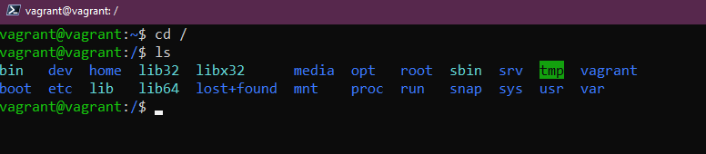
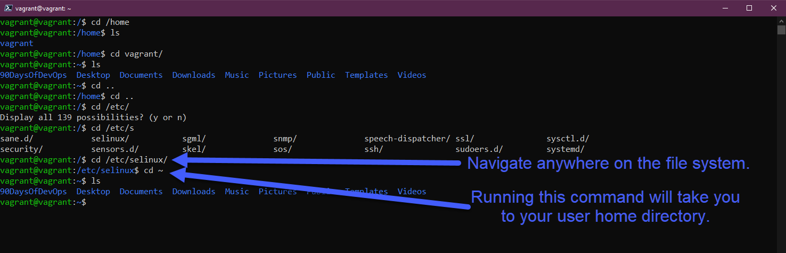
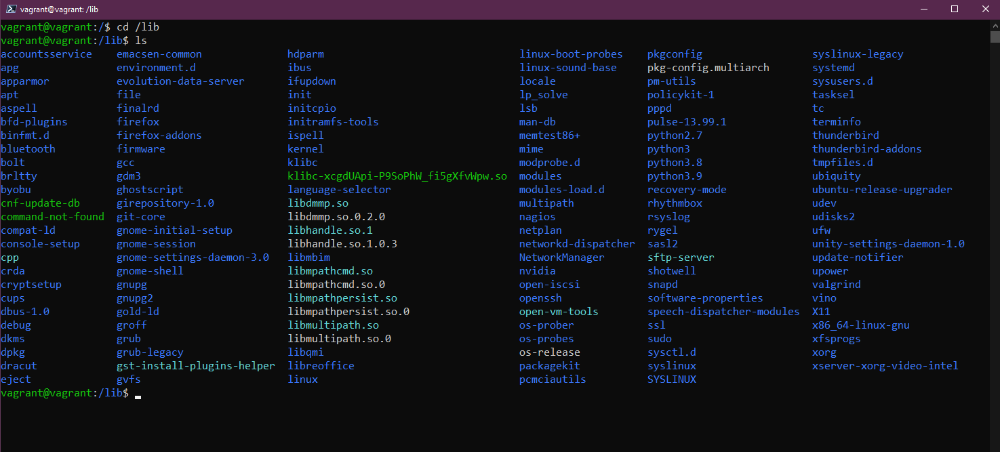
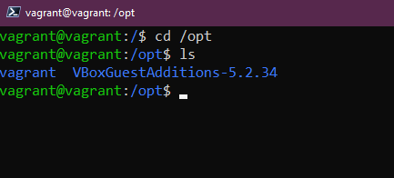
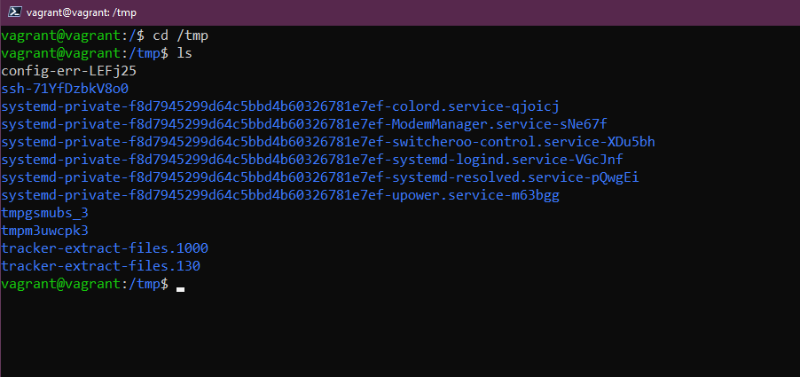
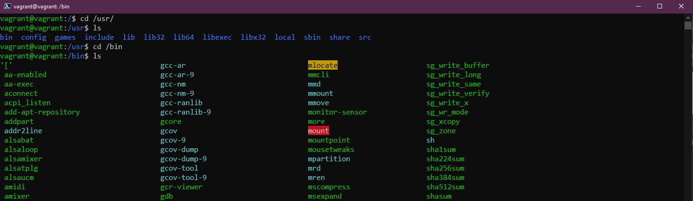

## Gestione del tuo Sistema Linux, File System & Storage

Finora abbiamo fatto una panoramica di Linux e DevOps, poi abbiamo configurato il nostro ambiente di lavoro usando Vagrant [(Giorno 14)](day14.md), quindi abbiamo affrontato una piccola porzione dei comandi che faranno parte del tuo kit quotidiano quando utilizzi il terminale [(Giorno 15)](day15.md).

Qui andremo ad esplorare tre aree fondamentali per la gestione dei sistemi Linux: gli aggiornamenti, l'installazione di software, la comprensione delle cartelle di sistema e daremo anche un'occhiata allo storage.

## Gestione di Ubuntu e del Software

La prima cosa che vedremo è come aggiornare il nostro sistema operativo. La maggior parte di voi sarà familiare con questo processo in Windows o macOS, ma su un desktop o server Linux è leggermente diverso.

Utilizzeremo il gestore dei pacchetti `apt` sulla nostra VM Ubuntu per gli aggiornamenti e l'installazione del software.

Generalmente, almeno sulle workstation di sviluppo, eseguo questo comando per assicurarmi di avere gli ultimi aggiornamenti disponibili dai repository centrali, prima di installare qualsiasi software.

```bash
sudo apt-get update
```


Adesso abbiamo una VM Ubuntu aggiornata con gli ultimi aggiornamenti del sistema operativo installati. Ora iniziamo ad installare del software.

Scegliamo `figlet`, un programma che genera testi in stile banner.

Se digitiamo `figlet` nel nostro terminale, vedremo che non è installato nel nostro sistema.


Tuttavia, dalla risposta otteniamo delle opzioni di installazione tramite `apt`. Questo perché nei repository predefiniti c'è un programma chiamato figlet. Proviamo `sudo apt install figlet`.


Adesso possiamo usare la nostra app `figlet`, come puoi vedere qui sotto.


Se volessimo rimuovere quel software o qualsiasi delle nostre installazioni software, possiamo farlo anche tramite il gestore dei pacchetti `apt`.

```bash
sudo apt remove figlet
```


Esistono repository di terze parti che possiamo aggiungere al nostro sistema, quelli a cui abbiamo accesso di default sono i repository predefiniti di Ubuntu.

Se, ad esempio, volessimo installare Vagrant sulla nostra VM Ubuntu, al momento non sarebbe possibile come puoi vedere di seguito al primo comando emesso. Aggiungiamo quindi la chiave per validare il repository HashiCorp, quindi aggiungiamo il repository al nostro sistema.


Una volta aggiunto il repository HashiCorp, possiamo procedere con l'installazione di Vagrant sul nostro sistema usando `sudo apt install vagrant`.


Ci sono molte opzioni quando si tratta di installazione di software, diverse opzioni per i gestori di pacchetti. Integrato in Ubuntu potremmo anche utilizzare gli "snaps" per le nostre installazioni software.

Spero che questo ti dia un'idea su come gestire il tuo OS e le installazioni di software su Linux.

## Il File System

Linux è costituito da file di configurazione; se vuoi cambiare qualcosa, dovrai modifichi questi file di configurazione.

In Windows hai il disco C: e quello è ciò che consideriamo il root. Su Linux abbiamo `/`, è qui che troveremo le cartelle importanti nel nostro sistema Linux.



- `/bin` - Abbreviazione di *binary*, la cartella bin è dove risiedono i file binari necessari al sistema, eseguibili e strumenti.


- `/boot` - Tutti i file necessari al sistema per avviarsi. Come avviare e da quale unità avviare.


- `/dev` - Troverai qui le informazioni sui dispositivi, è qui che troverai i puntatori ai tuoi dischi `sda` sarà il principale disco del Sistema Operativo.


- `/etc` - Probabilmente la cartella più importante sul tuo sistema Linux, è qui che risiedono la maggior parte dei tuoi file di configurazione.


- `/home` - è qui che troverai le cartelle e i file degli utenti. Abbiamo la cartella utente `vagrant`. Qui troverai le cartelle `Documenti` e `Desktop` in cui abbiamo lavorato nella sezione dei comandi.



- `/lib` - Abbiamo detto che `/bin` è dove risiedono i nostri file binari ed eseguibili e `/lib` è dove troverai le librerie condivise tra di loro.



- `/media` - Qui troveremo i dispositivi rimovibili.


- `/mnt` - È un punto di mount temporaneo. Ne parleremo di più nella prossima sezione sullo storage.


- `/opt` - Pacchetti software opzionali. Noterai qui che Vagrant e VirtualBox sono memorizzati qui.



- `/proc` - Informazioni sul kernel e sui processi, simile a `/dev`


- `/root` - Per ottenere accesso devi fare sudo in questa cartella. La cartella home per l'utente root.


- `/run` - Contenitore per gli stati delle applicazioni.


- `/sbin` - *Sudo bin*, simile alla cartella bin ma questi strumenti sono destinati a utenticon privilegi di superutente nel sistema.


- `/tmp` - File temporanei.



- `/usr` - Se noi come utente standard abbiamo installato pacchetti software, generalmente si trovano nella posizione `/usr/bin`.



- `/var` - Le nostre applicazioni vengono installate in una cartella `bin`. Abbiamo bisogno di un posto dove archiviare tutti i file di log e questo è `/var`


## Storage

Quando arriviamo ad un sistema Linux o a qualsiasi sistema, potremmo voler conoscere i dischi disponibili e quanto spazio libero abbiamo su quei dischi. I comandi seguenti ci aiuteranno a identificare, usare e gestire lo storage.

- `lsblk` Elenco dei dispositivi di blocco. `sda` è il nostro disco fisico e poi `sda1, sda2, sda3` sono le partizioni su quel disco.


- `df` ci fornisce un po' più dettagli sulle partizioni, totale, usato e disponibile. Puoi analizzare altre opzioni qui; generalmente uso `df -h` per ottenere un output umano dei dati.


Se stessi aggiungendo un nuovo disco al tuo sistema e questo è lo stesso in Windows, dovresti formattare il disco in gestione disco. Nel terminale Linux puoi farlo usando `sudo mkfs -t ext4 /dev/sdb` con sdb relativo al nostro disco appena aggiunto.

Dovremmo quindi montare il nostro disco appena formattato in modo che sia utilizzabile. Lo faremmo nella nostra cartella `/mnt` precedentemente menzionata e creeremmo lì una directory con `sudo mkdir NewDisk`, quindi useremmo `sudo mount /dev/sdb newdisk` per montare il disco in quella posizione.

È anche possibile che tu debba smontare lo storage dal tuo sistema in modo sicuro invece di semplicemente rimuoverlo dalla configurazione. Possiamo farlo con `sudo umount /dev/sdb`

Se non volessi smontare quel disco e lo volessi utilizzare per un database o un altro caso d'uso persistente, allora vuoi che sia presente quando riavvii il sistema. Per fare questo, devi aggiungere questo disco al file di configurazione `/etc/fstab`; se non lo fai, non sarà utilizzabile quando la macchina verrà riavviata e dovrai manualmente ripetere il processo sopra descritto. I dati saranno comunque presenti sul disco, ma non verrà montato automaticamente a meno che tu non aggiunga la configurazione a questo file.

Una volta modificato il file di configurazione `fstab`, puoi controllare il lavoro svolto con `sudo mount -a`. Se non ci sono errori, le tue modifiche saranno ora persistenti durante i riavvii.

In futuro vedremo come si modifica un file utilizzando un editor di testo.

## Risorse

- [Learn the Linux Fundamentals - Part 1](https://www.youtube.com/watch?v=kPylihJRG70)
- [Linux for hackers (don't worry you don't need to be a hacker!)](https://www.youtube.com/watch?v=VbEx7B_PTOE)

Ci vediamo al [Giorno 17](day17.md)
