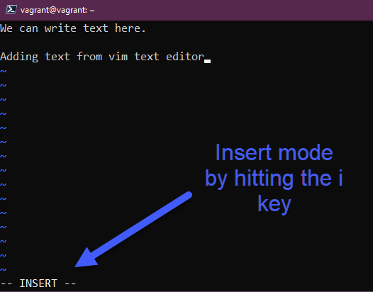
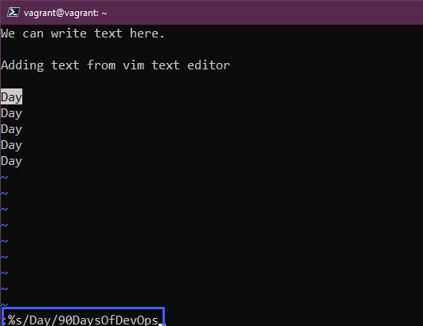

## Editor di Testo - nano vs vim

La maggior parte dei tuoi sistemi Linux sarà costituita da server e questi non avranno un'interfaccia grafica. Ho anche accennato nella sessione precedente che Linux è principalmente composto da file di configurazione; per apportare modifiche, sarà necessario essere in grado di modificare quei file per cambiare qualsiasi cosa nel sistema.

Ci sono molte opzioni, ma penso che dovremmo soffermarci sui due editor di testo da terminale più comuni. Li ho usati entrambi e per me `nano` è il modo più semplice per apportare modifiche rapide, ma `vim` ha un insieme molto ampio di capacità.

### nano

- Non disponibile su ogni sistema.
- Ottimo per iniziare.

Se esegui `nano 90DaysOfDevOps.txt`, creerai un nuovo file senza nulla al suo interno, da qui possiamo aggiungere il nostro testo e in basso abbiamo i comandi che possiamo usare.

Ora possiamo digitare `control x + enter` e poi eseguire `ls`, ora puoi vedere il nostro nuovo file di testo.

Possiamo eseguire `cat` sul nostro file per leggerlo. Possiamo poi utilizzare di nuovo `nano 90DaysOfDevOps.txt` per aggiungere testo o modificare il file.

Per me, nano è super facile quando si tratta di apportare piccole modifiche ai file di configurazione.

### vim

Probabilmente è l'editor di testo più comune. E' un parente dell'editor di testo UNIX `vi`` del 1976, con vim abbiamo ao disposizione molte funzionalità.

- Supportato praticamente su ogni singola distribuzione Linux.
- Incredibilmente potente! Probabilmente puoi trovare un corso completo di 7 ore solo su vim.

Possiamo accedere a vim con il comando `vim` o se vogliamo modificare il nostro nuovo file di testo, potremmo eseguire `vim 90DaysOfDevOps.txt`, ma all'inizio vedrai la mancanza di menu di aiuto in basso.

La prima domanda potrebbe essere "Come esco da vim?" per prima cosa `escape` poi `:q` ma solo se non abbiamo apportato modifiche.

Si inizia in modalità `normale`, ma ci sono altre modalità: `comando, normale, visuale, inserimento`, se vogliamo aggiungere del testo dovremo passare da `normale` a `inserimento`, per farlo dobbiamo premere `i`; se hai aggiunto del testo e desideri salvare queste modifiche, premi `esc` e poi `:wq`

Con il comando `cat` per verificare che hai salvato le modifiche.

C'è una funzionalità veloce e interessante con vim che ti consente di eseguire compiti banali molto rapidamente se conosci le scorciatoie di tastiera (che sono materia per una lezione a sé stante). Diciamo che abbiamo aggiunto una lista di parole ripetute e ora dobbiamo cambiarla, magari è un file di configurazione e la parola ripetuta è un nome di rete, ora questo è cambiato e vogliamo aggiornare tutti nomi rapidamente. Sto usando la parola "day" per questo esempio.

Ora vogliamo sostituire la parola "Day" con "90DaysOfDevOps", possiamo farlo premendo `ESC` e digitando `:%s/Day/90DaysOfDevOps`

Quando premi invio, la parola "day" viene quindi sostituita con "90DaysOfDevOps".

**Copia** e **Incolla** è stata una grande scoperta per me. Copia non è copiare ma "yankare" *(ndt: il termine "yanked" in informatica si riferisce generalmente all'azione di copiare o tagliare del testo o un elemento da una posizione e spostarlo altrove. In italiano, potrebbe essere tradotto come "estratto" o "prelevato", indicando il prelievo o l'estrazione di dati o elementi da una posizione per essere spostati altrove)*. Possiamo copiare usando `yy` sulla tastiera in modalità normale. `p` incolla sulla stessa linea, `P` incolla su una nuova linea.

Puoi anche cancellare queste linee scegliendo il numero di linee che desideri eliminare seguito da `dd`

È anche probabile che tu debba cercare all'interno di un file: possiamo usare `grep` come menzionato in una sessione precedente ma possiamo cercare anche con vim. Possiamo usare `/parola` e questo troverà la prima corrispondenza, per passare alla successiva userai il tasto `n` (**n**ext) e così via.

Queste poche cose cha abbiamo fatto con vim non ne scalfiscono nemmeno la superficie, il miglior consiglio che posso darti è metterci le mani sopra e usare vim ovunque sia possibile.

Una domanda comune durante un colloquio è qual è il tuo editor di testo preferito in Linux e mi assicurerei di avere almeno questa conoscenza di entrambi in modo da poter rispondere, va bene dire nano perché è semplice. Almeno dimostri competenza nella comprensione di cosa sia un editor di testo. Ma mettiti a usarli per essere più competente.

Un'altra scorciatoia per navigare in vim è `H, J, K, L` oltre alle frecce direzionali.

## Risorse

- [Vim in 100 Seconds](https://www.youtube.com/watch?v=-txKSRn0qeA)
- [Vim tutorial](https://www.youtube.com/watch?v=IiwGbcd8S7I)
- [Learn the Linux Fundamentals - Part 1](https://www.youtube.com/watch?v=kPylihJRG70)
- [Linux for hackers (don't worry you don't need to be a hacker!)](https://www.youtube.com/watch?v=VbEx7B_PTOE)

Ci vediamo al [Giorno 18](day18.md)