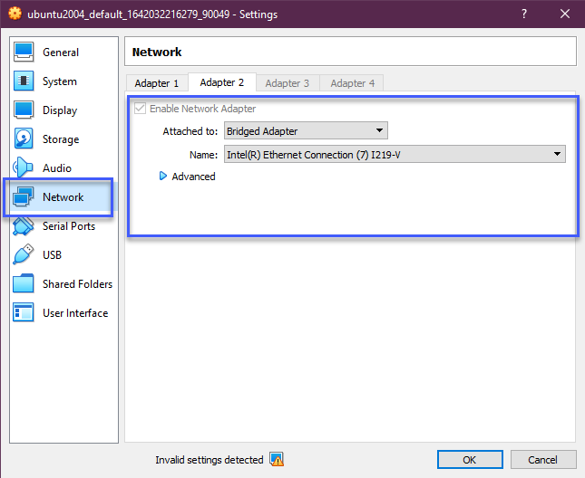
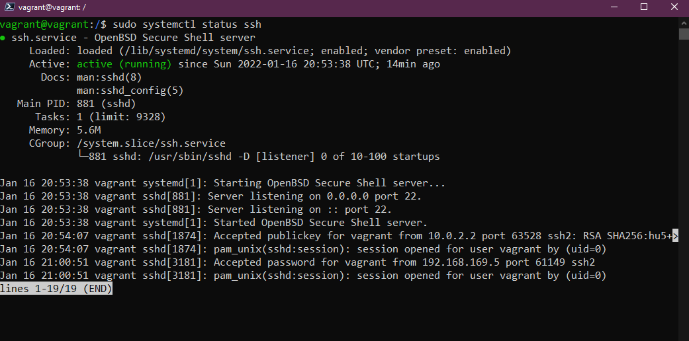
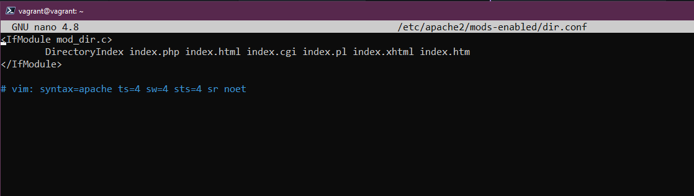

### SSH & Server Web

Come accennato in precedenza, molto probabilmente gestirai molti server Linux remoti, quindi sarà importante assicurarsi che la connettività a questi server remoti sia sicura. In questa sezione, vogliamo coprire alcuni concetti di base di SSH che tutti dovrebbero conoscere per stabilire connessioni sicure verso i sistemi remoti:

- Stabilire una connessione tramite SSH
- Trasferire file
- Creare la tua chiave privata

### Introduzione a SSH

- Shell sicura
- Protocollo di rete
- Consente comunicazioni sicure
- Può proteggere qualsiasi servizio di rete
- Usato tipicamente per l'accesso remoto da linea di comando

Nel nostro ambiente, se hai seguito finora, abbiamo utilizzato già SSH, ma tutto è stato configurato e automatizzato tramite la configurazione di Vagrant, quindi abbiamo solo eseguito `vagrant ssh` per accedere alla nostra macchina virtuale remota.

Se la nostra macchina remota non fosse nello stesso sistema della nostra postazione di lavoro e fosse in una posizione remota, ad esempio un sistema basato su cloud o in esecuzione in un data center accessibile solo via internet, avremmo bisogno di un modo sicuro per accedere al sistema e per gestirlo.

SSH fornisce la connessione attraverso un tunnel sicuro tra client e server in modo che nulla possa essere intercettato da persone non autorizzate.


Il server ha un servizio SSH lato server sempre in esecuzione e in ascolto su una porta TCP specifica (22).

Se utilizziamo il nostro client per connetterci con le credenziali corrette o con la chiave SSH, otteniamo l'accesso a quel server.

### Aggiungere un adattatore di rete in bridge al nostro sistema

Per poter utilizzare questo con la nostra attuale VM Virtual Box, dobbiamo aggiungere un adattatore di rete in bridge alla nostra macchina.

Spegni la tua macchina virtuale, fai clic con il tasto destro sulla tua macchina all'interno di Virtual Box e seleziona impostazioni. Nella nuova finestra seleziona networking.



Ora riaccendi la tua macchina e avrai un indirizzo IP sulla tua macchina locale. Puoi confermare questo con il comando `IP addr`.

### Verifica del funzionamento del server SSH

Sappiamo che SSH è già configurato sulla nostra macchina perché lo abbiamo usato con Vagrant, ma possiamo confermarlo eseguendo

`sudo systemctl status ssh`



Se il tuo sistema non ha il server SSH, puoi installarlo tramite il comando `sudo apt install OpenSSH-server`

Dopodiché vorrai assicurarti che il nostro SSH sia consentito con il firewall in esecuzione. Possiamo farlo con `sudo ufw allow ssh` anche se non è richiesto nella nostra configurazione poiché l'abbiamo automatizzato con la nostra configurazione di Vagrant.

### Accesso remoto - Password SSH

Ora che il nostro server SSH è in ascolto sulla porta 22 per eventuali richieste di connessione in ingresso e abbiamo aggiunto il networking in bridge, potremmo usare Putty o un client SSH sulla nostra macchina locale per connetterci al nostro sistema usando SSH.

 [# Guida all'installazione di PuTTy](https://www.cuit.columbia.edu/putty).


Quindi fai clic su Open, se è la prima volta che ti colleghi a questo sistema tramite questo indirizzo IP, otterrai il seguente avviso. Sappiamo che questo è il nostro sistema, quindi puoi scegliere Yes.


Dopodiché ci viene chiesto il nostro nome utente (vagrant) e la password (password predefinita - vagrant). Di seguito vedrai che stiamo ora utilizzando il nostro client SSH (Putty) per connetterci alla nostra macchina utilizzando nome utente e password.


A questo punto, siamo connessi alla nostra VM dal nostro client remoto e possiamo impartire comandi al nostro sistema.

### Accesso remoto - Chiave SSH

Quanto sopra è un modo semplice per accedere ai sistemi, tuttavia si basa ancora su nome utente e password. Se un malintenzionato dovesse ottenere queste informazioni, compreso l'indirizzo IP pubblico del tuo sistema, esso potrebbe essere facilmente compromesso. Ecco perché si preferiscono le chiavi SSH.

Usare le chiavi SSH significa fornire una coppia di chiavi in modo che sia il client che il server sappiano che questo è un dispositivo attendibile.

Creare una chiave è semplice. Sulla nostra macchina locale (Windows) possiamo eseguire il seguente comando, se hai un client SSH installato su qualsiasi sistema, credo che lo stesso comando funzionerà.

`ssh-keygen -t ed25519`

Non entrerò nei dettagli di cosa sia e cosa significhi `ed25519` qui, ma puoi fare una ricerca se vuoi saperne di più sulla [crittografia](https://en.wikipedia.org/wiki/EdDSA#Ed25519)


A questo punto, abbiamo la nostra chiave SSH creata memorizzata in `C:\Users\micha/.ssh/`

Ma per collegarla con la nostra VM Linux, dobbiamo copiare la chiave. Possiamo farlo usando `ssh-copy-id vagrant@192.168.169.135`

Ho usato Powershell per creare le mie chiavi sul mio client Windows, ma qui non c'è `ssh-copy-id`. Ci sono vari modi in cui puoi farlo su Windows e una breve ricerca online ti troverà un'alternativa, ma userò git bash sulla mia macchina Windows per fare la copia.


Ora possiamo tornare a Powershell per verificare se la nostra connessione funziona con le chiavi SSH e che non richieda password.

`ssh vagrant@192.168.169.135`


Potremmo rendere questo ancora più sicuro, se necessario, usando una *passphrase*. Potremmo anche andare oltre dicendo che non sono affatto consentite password, il che significa che sarebbero permessi solo le coppie di chiavi SSH. Puoi farlo nel seguente file di configurazione.

`sudo nano /etc/ssh/ss hd_config`

c'è una riga qui con `PasswordAuthentication yes` questo sarà commentato con `#`, dovresti togliere il commento e cambiare *yes* in *no*. Poi dovrai ricaricare il servizio SSH con `sudo systemctl reload sshd`

## Configurare un server Web

Non è direttamente correlato a ciò che abbiamo appena fatto con SSH, ma ho voluto includerlo perché è ancora un altro compito che potresti trovare un po' intimidatorio anche se non dovrebbe esserlo.

Abbiamo la nostra VM Linux e in questa fase vogliamo aggiungere un server web Apache alla nostra VM in modo da poter ospitare un sito web semplice che serve alla mia rete domestica. Nota che questa pagina web non sarà accessibile da Internet, questo si può fare ma non ne discuteremo qui.

Potresti anche vederlo chiamato stack **LAMP**.

- **L**inux Sistema Operativo
- **A**pache Web Server
- **m**ySQL database
- **P**HP

### Apache2

Apache2 è un server HTTP open source. Possiamo installare apache2 con il seguente comando.

`sudo apt-get install apache2`

Per confermare che apache2 sia installato correttamente possiamo eseguire `sudo service apache2 restart`

Quindi usando l'indirizzo di rete in bridge dalla procedura di SSH, apri un browser e vai a quell'indirizzo. Il mio era `http://192.168.169.135/`


### mySQL

MySQL è un database in cui memorizzeremo i dati per il nostro semplice sito web. Per installare MySQL dovremmo usare il seguente comando `sudo apt-get install mysql-server`

### PHP

PHP è un linguaggio di scripting lato server, lo useremo per interagire con un database MySQL. L'ultima installazione è per ottenere PHP e le dipendenze installate usando `sudo apt-get install php libapache2-mod-php php-mysql`

Il primo cambiamento di configurazione che vogliamo fare di default di apache è utilizzare index.html e vogliamo usare index.php invece.

Useremo `sudo nano /etc/apache2/mods-enabled/dir.conf` e sposteremo index.php come primo elemento nella lista.



Riavvia il servizio apache2 `sudo systemctl restart apache2`

Ora confermeremo che il nostro sistema è configurato correttamente per PHP. Crea il seguente file usando questo comando, si aprirà un file vuoto in nano.

`sudo nano /var/www/html/90Days.php`

quindi copia quanto segue e usa control + x per uscire e salvare il tuo file.

```
<?php
phpinfo();
?>
```

Ora vai di nuovo all'indirizzo IP della tua VM Linux con aggiunta 90Days.php alla fine dell'URL. `http://192.168.169.135/90Days.php` dovresti vedere qualcosa di simile a quanto segue se PHP è configurato correttamente.


### Installazione di WordPress

Ho poi seguito questo tutorial per ottenere WordPress sul nostro stack LAMP, alcuni comandi sono mostrati di seguito se non sono visualizzati correttamente nel tutorial [How to install WordPress on Ubuntu with LAMP](https://blog.ssdnodes.com/blog/how-to-install-wordpress-on-ubuntu-18-04-with-lamp-tutorial/)

`sudo mysql -u root -p`

`CREATE DATABASE wordpressdb;`

`CREATE USER 'admin-user'@'localhost' IDENTIFIED BY 'password';`

`GRANT ALL PRIVILEGES ON wordpressdb.* TO 'admin-user'@'localhost';`

`FLUSH PRIVILEGES;`

`EXIT;`

`sudo apt install php-curl php-gd php-mbstring php-xml php-xmlrpc php-soap php-intl php-zip`

`sudo systemctl restart apache2`

`cd /var/www`

`sudo curl -O https://wordpress.org/latest.tar.gz`

`sudo tar -xvf latest.tar.gz`

`sudo rm latest.tar.gz`

A questo punto ti trovi nello Step 4 dell'articolo collegato, dovrai seguire i passaggi per assicurarti che tutti i permessi corretti siano in atto per la directory di WordPress.

Poiché questo è solo interno, non è necessario "generare chiavi di sicurezza" in questo passaggio. Passa allo Step 5 che consiste nel cambiare la configurazione di Apache per WordPress.

Poi, a condizione che tutto sia configurato correttamente, sarai in grado di accedere tramite il tuo indirizzo di rete interno ed eseguire l'installazione di WordPress.

## Risorse

- [Client SSH GUI - Remmina](https://remmina.org/)
- [The Beginner's guide to SSH](https://www.youtube.com/watch?v=2QXkrLVsRmk)
- [Vim in 100 Seconds](https://www.youtube.com/watch?v=-txKSRn0qeA)
- [Vim tutorial](https://www.youtube.com/watch?v=IiwGbcd8S7I)
- [Learn the Linux Fundamentals - Part 1](https://www.youtube.com/watch?v=kPylihJRG70)
- [Linux for hackers (don't worry you don't need to be a hacker!)](https://www.youtube.com/watch?v=VbEx7B_PTOE)

Ci vediamo il [Giorno19](day19.md)
