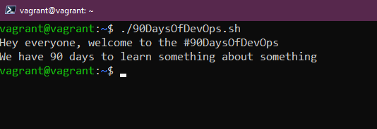
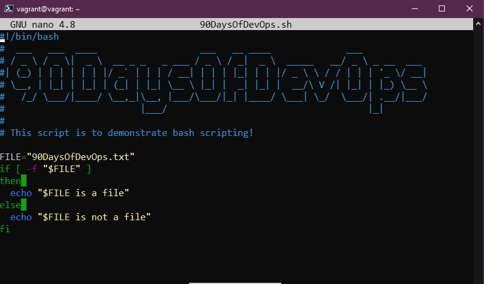
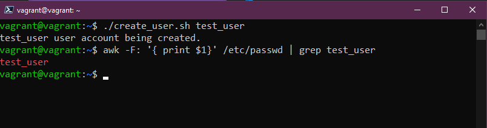

### Automatizzare compiti con script Bash

Oggi utilizzeremo la shell bash, ma domani affronteremo un'altra shell: ZSH.

BASH - **B**ourne **A**gain **Sh**ell

Potremmo dedicare quasi una sezione intera di 7 giorni alla scrittura di script della shell, proprio come facciamo con i linguaggi di programmazione. Bash ci permette di lavorare insieme ad altri strumenti di automazione per ottenere risultati.

Parlo ancora con molte persone che hanno configurato degli script della shell complessi per ottenere determinati risultati e si affidano a questi script per alcune delle attività più importanti dell'azienda. Non sto dicendo che dobbiamo capire la scrittura di script shell/bash per questo scopo, non è questo il punto. Ma dovremmo imparare la scrittura di script shell/bash per lavorare insieme ai nostri strumenti di automazione e per compiti ad hoc.

Un esempio di ciò che abbiamo usato in questa sezione potrebbe essere il file VAGRANTFILE che abbiamo usato per creare la nostra VM. Potremmo incapsularlo in uno script bash semplice che elimina e rinnova la nostra VM Linux ogni lunedì mattina, così da averne una copia fresca ogni settimana. Potremmo anche aggiungere tutta la pila software di cui abbiamo bisogno su quella macchina Linux e così via, tutto tramite un unico script bash.

Un'altra cosa che sto notando è che le domande pratiche sulla scrittura di script stanno diventando sempre più evidenti in tutti i tipi di colloqui.

### Cominciamo

Come con molte cose che stiamo affrontando in questi 90 giorni, l'unico vero modo per imparare è fare. L'esperienza pratica ti aiuterà a memorizzare tutto meglio.

Prima di tutto, avremo bisogno di un editor di testo. Il [Giorno 17](day17.md) abbiamo trattato i due editor di testo probabilmente più comuni ed abbiamo imparato un po' su come utilizzarli.

Passiamo subito alla creazione del nostro primo script della shell.

`touch 90DaysOfDevOps.sh`

Poi `nano 90DaysOfDevOps.sh` aprirà il nostro nuovo script vuoto nella nano. Naturalmente puoi scegliere il tuo editor di testo preferito qui.

La prima riga di tutti gli script bash dovrà assomigliare a qualcosa del genere: `#!/usr/bin/bash`, questo è il percorso del tuo binario bash.

Verifica se il percorso è giusto eseguendo nel terminale `which bash`, se non stai usando Ubuntu potresti provare anche `whereis bash`.

Potresti vedere altri percorsi negli script della shell già creati che potrebbero includere:

- `#!/bin/bash`
- `#!/usr/bin/env bash`

Nella riga successiva nel nostro script, mi piace aggiungere un commento e aggiungere lo scopo dello script o almeno alcune informazioni su di me. Puoi farlo usando `#`. Questo ci consente di commentare su linee specifiche del nostro codice e fornire descrizioni di ciò che faranno i comandi successivi. Trovo che avere più note sia migliore per l'esperienza utente, specialmente se stai condividendo questo lo script.
A volte uso figlet, un programma che abbiamo installato in precedenza nella sezione Linux, per creare un po' di arte ASCII per dare il via ai nostri script.


Tutti i comandi che abbiamo visto in precedenza in questa sezione Linux ([Giorno 15](day15.md)) potrebbero essere utilizzati qui come un semplice comando per testare il nostro script.

Aggiungiamo un semplice blocco di codice al nostro script.

```
mkdir 90DaysOfDevOps
cd 90DaysOfDevOps
touch Day19
ls
```

Puoi quindi salvare ed uscire dal tuo editor di testo, se eseguiamo lo script con `./90DaysOfDevOps.sh` dovresti ricevere un messaggio di permesso negato. Puoi controllare i permessi di questo file usando il comando `ls -al` e vedrai evidenziato che non abbiamo i diritti di esecuzione su questo file.


Possiamo cambiarli usando `chmod +x 90DaysOfDevOps.sh` e quindi vedrai la `x`, il che significa che possiamo ora eseguire il nostro script.


Ora possiamo eseguire di nuovo il nostro script usando `./90DaysOfDevOps.sh`. Dopo aver eseguito lo script, è stata creata una nuova directory, ci siamo spostati in quella directory e quindi  abbiamo creato un nuovo file.


Comandi piuttosto di base, ma puoi iniziare a vedere come gli script potrebbero essere utilizzati per chiamare altri strumenti in modo per semplificare la vita e automatizzare le cose.

### Variabili, Condizionali

Gran parte di questa sezione è una ripetizione di ciò che abbiamo visto quando stavamo imparando Go, ma penso che valga la pena immergerci di nuovo.

- ### Variabili

Le variabili ci consentono di definire una volta un termine particolare che viene utilizzato in uno script potenzialmente complesso.

Per aggiungere una variabile, la inserisci semplicemente in questo modo in una riga pulita nel tuo script.

`challenge="90DaysOfDevOps"`

In questo modo, quando e dove usiamo `$challenge` nel nostro codice, se cambiamo il valore della variabile, sarà riflesso ovunque.


Se ora eseguiamo il nostro script `sh`, vedrai la stampa che è stata aggiunta al nostro script.



Possiamo anche chiedere un input dall'utente che può impostare le nostre variabili utilizzando quanto segue:

```
echo "enter your nome"
read name
```

Questo definirà l'input come la variabile `$name` che potremmo poi utilizzare in seguito.

- ### Condizionali

Forse vogliamo sapere chi abbiamo nella nostra sfida e quante giornate hanno completato, possiamo definire questo aspetto usando `if` `if-else` `else-if`, è ciò che abbiamo definito di seguito nel nostro script.

```
#!/bin/bash
#  ___   ___  ____                   ___   __ ____              ___
# / _ \ / _ \|  _ \  __ _ _   _ ___ / _ \ / _|  _ \  _____   __/ _ \ _ __  ___
#| (_) | | | | | | |/ _` | | | / __| | | | |_| | | |/ _ \ \ / / | | | '_ \/ __|
# \__, | |_| | |_| | (_| | |_| \__ \ |_| |  _| |_| |  __/\ V /| |_| | |_) \__ \
#   /_/ \___/|____/ \__,_|\__, |___/\___/|_| |____/ \___| \_/  \___/| .__/|___/
#                         |___/                                     |_|
#
# This script is to demonstrate bash scripting!

# Variables to be defined

ChallengeName=#90DaysOfDevOps
TotalDays=90

# User Input

echo "Enter Your Name"
read name
echo "Welcome $name to $ChallengeName"
echo "How Many Days of the $ChallengeName challenge have you completed?"
read DaysCompleted

if [ $DaysCompleted -eq 90 ]
then
  echo "You have finished, well done"
elif [ $DaysCompleted -lt 90 ]
then
  echo "Keep going you are doing great"
else
  echo "You have entered the wrong amount of days"
fi
```

Dallo script puoi anche vedere che stiamo eseguendo alcune comparazioni o controllando i valori tra loro per passare allo stadio successivo. Abbiamo diverse opzioni qui da notare.

- `eq` - se i due valori sono uguali restituirà VERO
- `ne` - se i due valori non sono uguali restituirà VERO
- `gt` - se il primo valore è maggiore del secondo valore restituirà VERO
- `ge` - se il primo valore è maggiore o uguale al secondo valore restituirà VERO
- `lt` - se il primo valore è minore del secondo valore restituirà VERO
- `le` - se il primo valore è minore o uguale al secondo valore restituirà VERO

Potremmo anche usare lo script bash per ottenere informazioni su file e cartelle, questo è noto come file conditions.

- `-d file` Vero se il file è una directory
- `-e file` Vero se il file esiste
- `-f file` Vero se la stringa fornita è un file
- `-g file` Vero se l'id del gruppo è impostato su un file
- `-r file` Vero se il file è leggibile
- `-s file` Vero se il file ha una dimensione non zero

```
FILE="90DaysOfDevOps.txt"
if [ -f "$FILE" ]
then
  echo "$FILE è un file"
else
  echo "$FILE non è un file"
fi
```



A condizione che quel file sia ancora nella nostra directory, dovremmo ottenere il primo comando di echo. Ma se rimuoviamo quel file, dovremmo ottenere il secondo comando di echo.


Spero tu possa vedere come questo possa essere usato per risparmiare tempo quando cerchi elementi specifici in un sistema.

Ho trovato questo incredibile repository su GitHub che sembra avere un numero infinito di script [DevOps Bash Tools](https://github.com/HariSekhon/DevOps-Bash-tools/blob/master/README.md)

### Esempio

**Scenario**: Abbiamo la nostra azienda chiamata "90DaysOfDevOps" e siamo attivi da un po' e ora è il momento di espandere il team da 1 persona a molte altre nelle prossime settimane, finora sono l'unico che conosce il processo di integrazione quindi vogliamo ridurre quel collo di bottiglia automatizzando alcune di queste attività.

**Requisiti**:

- Un utente può essere passato come argomento della riga di comando.
- Viene creato un utente con il nome dell'argomento della riga di comando.
- Una password può essere interpretata come argomento della riga di comando.
- La password viene impostata per l'utente.
- Viene visualizzato un messaggio di creazione dell'account riuscito.

Cominciamo a creare il nostro script della shell con `touch create_user.sh`

Prima di andare avanti, rendiamolo già eseguibile usando `chmod +x create_user.sh` poi possiamo usare `nano create_user.sh` per iniziare a modificare il nostro script per lo scenario che ci è stato impostato.

Possiamo dare un'occhiata al primo requisito "Un utente può essere passato come argomento della riga di comando", possiamo usare quanto segue

```bash
#! /usr/bin/bash

# A user can be passed in a command line argument
echo "$1"
```


Vai avanti ed esegui questo usando `./create_user.sh Michael` sostituendo Michael con il tuo nome quando esegui lo script.


Il prossimo passo è affrontare il secondo requisito "Viene creato un utente con il nome dell'argomento della riga di comando" e questo può essere fatto con il comando `useradd`. L'opzione `-m` serve per creare la directory home dell'utente come /home/username

```bash
#! /usr/bin/bash

# A user can be passed in a command line argument
echo "$1 user account can being created."

# A user can be created with the name of the command line argument
sudo useradd -m "$1"

```

Attenzione: se non fornisci un nome utente, si verificherà un errore in quanto non abbiamo dato un valore alla variabile `$1`.

Successivamente possiamo verificare se questo account è stato creato con il comando `awk -F: '{ print $1}' /etc/passwd`.



Il nostro prossimo requisito è "Una password può essere analizzata come argomento della riga di comando". Prima di tutto: non lo faremo mai in produzione, è più per lavorare su una lista di requisiti per la nostra comprensione.

```bash
#! /usr/bin/bash

# A user can be passed in a command line argument
echo "$1 user account can being created."

# A user can be created with the name of the command line argument
sudo useradd -m "$1"

# A password can be parsed as a command line argument.
sudo chpasswd <<< "$1":"$2"
```

Eseguiamo quindi questo script con i due parametri `./create_user.sh 90DaysOfDevOps password`

Puoi vedere dall'immagine qui sotto che abbiamo eseguito il nostro script, ha creato il nostro utente e la password e poi siamo manualmente entrati in quell'utente, confermiamo se ciò è avvenuto con il comando `whoami`.


Il requisito finale è "Viene visualizzato un messaggio di creazione dell'account riuscita". Lo abbiamo già nella prima riga del nostro codice e possiamo vedere sullo screenshot di cui sopra che abbiamo un "Account utente 90DaysOfDevOps in fase di creazione". Questo è stato lasciato dal nostro test con il parametro `$1`.

Ora, questo script può essere utilizzato per integrare e configurare rapidamente nuovi utenti sui nostri sistemi Linux. Potremmo aggiungere gli input utente che abbiamo già trattato in precedenza per acquisire le nostre variabili.

```bash
#! /usr/bin/bash

echo "What is your intended username?"
read  username
echo "What is your password?"
read  password

# A user can be passed in a command line argument
echo "Creazione dell'account utente $username."

# A user can be created with the name of the command line argument
sudo useradd -m $username

# A password can be parsed as a command line argument.
sudo chpasswd <<< $username:$password
```

Con i passaggi che diventano più interattivi,


Per concludere, forse vogliamo avere un output per dire che il nostro nuovo account utente è stato creato con successo.


Una cosa che ho notato è che stiamo visualizzando la password durante il nostro input e possiamo nasconderla usando il flag `-s` nella riga di codice `read -s password`


Se vuoi eliminare l'utente che hai creato a scopo di laboratorio, puoi farlo con `sudo userdel test_user`

[Esempio di script](Linux/create-user.sh)

Ancora una volta, non sto dicendo che questo è ciò che creerai nel tuo lavoro quotidiano, ma è qualcosa che ho pensato potesse evidenziare la flessibilità di ciò che potresti utilizzare per la creazione di script shell.

Pensa a qualsiasi attività ripetitiva che fai ogni giorno, settimana o mese e come potresti automatizzarla meglio, la prima opzione sarà probabilmente utilizzare uno script bash prima di passare a qualcosa di più complesso.

Ho creato un file bash molto semplice che mi aiuta a avviare un cluster Kubernetes utilizzando minikube sulla mia macchina locale insieme a servizi dati e Kasten K10 per dimostrare i requisiti e le necessità legati alla gestione dei dati: [Project Pace](https://github.com/MichaelCade/project_pace/blob/main/singlecluster_demo.sh). Tuttavia non ho ritenuto appropriato parlarne qui poiché non abbiamo ancora parlato di Kubernetes.

## Risorse

- [Bash in 100 seconds](https://www.youtube.com/watch?v=I4EWvMFj37g)
- [Bash script with practical examples - Full Course](https://www.youtube.com/watch?v=TPRSJbtfK4M)
- [Client SSH GUI - Remmina](https://remmina.org/)
- [The Beginner's guide to SSH](https://www.youtube.com/watch?v=2QXkrLVsRmk)
- [Vim in 100 Seconds](https://www.youtube.com/watch?v=-txKSRn0qeA)
- [Vim tutorial](https://www.youtube.com/watch?v=IiwGbcd8S7I)
- [Learn the Linux Fundamentals - Part 1](https://www.youtube.com/watch?v=kPylihJRG70)
- [Linux for hackers (don't worry you don't need to be a hacker!)](https://www.youtube.com/watch?v=VbEx7B_PTOE)


Ci vediamo al [Giorno20](day20.md)

---