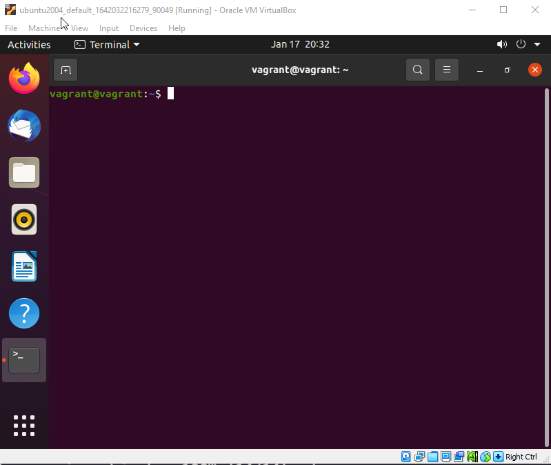

### Configurazione della workstation per lo sviluppo - Tutte le cose carine

Non la dobbiamo confondere con il nostro modo di configurare i server Linux, ma volevo mostrare anche le scelte e la flessibilità che abbiamo all'interno del desktop Linux.

Utilizzo un Desktop Linux da quasi un anno e l'ho configurato esattamente come voglio dal punto di vista dell'aspetto visivo. Utilizzando la nostra VM Ubuntu su Virtual Box, possiamo provare alcune delle personalizzazioni che ho apportato per mio utilizzo quotidiano.

Ho creato un video su YouTube per mostrarvelo, qualcuno potrebbero seguire meglio in questo modo:

Appena installato, il nostro sistema sarà simile a quanto mostrato di seguito:

Possiamo anche vedere la nostra shell bash predefinita qui sotto:

Molto di questo si basa sui file di configurazione, qualcosa che affronteremo in questa sessione finale di Linux.

### File di configurazione (dotfiles)

Innanzitutto, voglio approfondire i file di configurazione, ho detto in un giorno precedente che Linux è costituito da file di configurazione. Questi dotfiles sono file di configurazione per il tuo sistema Linux e per le applicazioni.

Aggiungo che i dotfiles non sono solo utilizzati per personalizzare e rendere più bello il tuo desktop, ma ci sono anche modifiche e configurazioni che ti aiuteranno nella produttività.

Come ho già detto, molti programmi memorizzano le loro configurazioni in questi dotfiles che pertanto ci aiutano nella gestione delle funzionalità.

Ogni dotfile inizia con un `.`. Probabilmente puoi indovinare da dove viene il nome, vero?

Finora abbiamo usato bash come nostra shell, il che significa che avrai un file `.bashrc` e uno `.bash_profile` nella nostra cartella home. Puoi vedere qui sotto alcuni dotfiles che abbiamo sul nostro sistema.

Cambieremo la nostra shell, quindi vedremo più tardi un nuovo file di configurazione `.zshrc`.

Ma ora sai che, quando ci riferiamo ai dotfiles, sono file di configurazione. Possiamo usarli per aggiungere alias al nostro prompt dei comandi e percorsi a posizioni diverse. Alcune persone pubblicano i loro dotfiles in modo che siano pubblicamente disponibili. Troverai i miei sul mio repository GitHub [MichaelCade/dotfiles](https://github.com/MichaelCade/dotfiles), dove c'è il mio file `.zshrc` personalizzato, il mio terminale preferito è terminator, che ha anche alcuni file di configurazione nella cartella e anche alcune opzioni di sfondo.

### ZSH

Come ho, finora abbiamo usato una shell bash, la shell predefinita di Ubuntu. ZSH è molto simile, ma ha alcuni vantaggi rispetto a bash.

Zsh ha funzionalità come il completamento interattivo delle tabulazioni, la ricerca automatica dei file, l'integrazione regex, un metodo abbreviato avanzato per definire lo scope del comando e un motore di temi avanzato.

Possiamo usare il nostro gestore di pacchetti `apt` per installare zsh sul nostro sistema. Andiamo avanti e eseguiamo `sudo apt install zsh` dalla nostra shell bash. Farò questo direttamente dalla console della VM anziché connettermi via SSH.

Quando il comando di installazione è completo, puoi eseguire `zsh` all'interno del tuo terminale, questo avvierà uno script di configurazione della shell.

Ho selezionato `1` alla domanda sopra e ora abbiamo alcune opzioni in più.

Dalla schermata sopra, puoi vedere che possiamo apportare alcune modifiche predefinite per configurare ZSH secondo le nostre esigenze.

Se esci dalla procedura guidata con un `0` e poi usi il comando `ls -al | grep .zshrc`, dovresti vedere un nuovo file di configurazione.

Ora vogliamo rendere zsh la nostra shell predefinita ogni volta che apriamo il nostro terminale, possiamo farlo eseguendo il seguente comando `chsh -s $(which zsh)`, poi usciamo e rientriamo di nuovo nel terminale per applicare le modifiche.

Quando rientri il terminale dovrebbe assomigliare a questo. Possiamo anche verificare che la nostra shell è stata cambiata eseguendo `which $SHELL`

In genere eseguo questo passaggio su ciascun desktop Ubuntu che configuro e in generale, senza andare oltre, la shell zsh è un po' più veloce di bash.

### OhMyZSH

Passiamo ora a rendere le cose un po' più belle e aggiungiamo anche alcune funzionalità per aiutarci a muoverci all'interno del terminale.

OhMyZSH è un framework gratuito e open source per la gestione della tua configurazione zsh. Ci sono molti plugin, temi e altre cose che rendono l'interazione con la shell zsh molto più piacevole.

Puoi scoprire di più su [Oh My ZSH](https://ohmyzsh.sh/)

Installiamo Oh My ZSH, abbiamo alcune opzioni con `curl`, `wget` o `fetch`, ma abbiamo gli ultimi 2 già disponibili sul nostro sistema, quindi userò `curl`

`sh -c "$(curl -fsSL https://raw.githubusercontent.com/ohmyzsh/ohmyzsh/master/tools/install.sh)"`

Quando hai eseguito il comando sopra, dovresti vedere un output come quello sotto.

Ora possiamo passare a iniziare a impostare un tema per la nostra esperienza. Ce ne sono ben oltre 100 inclusi in Oh My ZSH, ma il mio preferito per tutte le mie applicazioni e per tutto è il tema Dracula.

Voglio aggiungere che questi due plugin sono un must quando si utilizza Oh My ZSH.

`git clone https://github.com/zsh-users/zsh-autosuggestions.git $ZSH_CUSTOM/plugins/zsh-autosuggestions`

`git clone https://github.com/zsh-users/zsh-syntax-highlighting.git $ZSH_CUSTOM/plugins/zsh-syntax-highlighting`

`nano ~/.zshrc`

Poi modifica la sezione del dotfile *plugin* per includere `plugins=(git zsh-autosuggestions zsh-syntax-highlighting)`

## Estensioni di Gnome

Io utilizzo anche le estensioni di Gnome, in particolare la lista qui sotto

[Estensioni di Gnome](https://extensions.gnome.org)

- Caffeine
- CPU Power Manager
- Dash to Dock
- Desktop Icons
- User Themes

## Installazione del software

Una breve lista dei programmi che ho installato sulla mia macchina utilizzando `apt`

- VSCode
- azure-cli
- containerd.io
- docker
- docker-ce
- google-cloud-sdk
- insomnia
- packer
- terminator
- terraform
- vagrant

### Tema Dracula

Questo sito è l'unico tema che sto utilizzando al momento. Ha un aspetto chiaro e pulito ed è fantastico anche quando hai molti altri programmi sul tuo computer. [Tema Dracula](https://draculatheme.com/)

Dal link sopra, possiamo cercare zsh sul sito e troverai almeno due opzioni.

Segui le istruzioni elencate per installarlo manualmente o utilizzando git. Poi dovrai infine modificare il tuo file di configurazione `.zshrc` come mostrato di seguito.

Successivamente, vorrai il [tema Gnome Terminal Dracula](https://draculatheme.com/gnome-terminal) con tutte le istruzioni disponibili anche qui.

Mi ci vorrebbe molto tempo per documentare ogni passaggio, quindi ho creato un video passo passo del processo. (**Clicca sull'immagine sotto**)

Se sei arrivato fin qui, abbiamo ora concluso la nostra sezione Linux dei #90DaysOfDevOps. Ancora una volta sono aperto a feedback e a nuove risorse da aggiungere.

Ho anche pensato che fosse più semplice mostrare molti dei passaggi attraverso video anziché scriverli qui, cosa ne pensi? Ho l'obiettivo di lavorare su questi giorni e, quando possibile, creare video passo passo per aggiungere e spiegare meglio alcune delle cose che abbiamo coperto. Cosa ne pensi?

## Risorse

- [Bash in 100 seconds](https://www.youtube.com/watch?v=I4EWvMFj37g)
- [Bash script with practical examples - Full Course](https://www.youtube.com/watch?v=TPRSJbtfK4M)
- [Client SSH GUI - Remmina](https://remmina.org/)
- [The Beginner's guide to SSH](https://www.youtube.com/watch?v=2QXkrLVsRmk)
- [Vim in 100 Seconds](https://www.youtube.com/watch?v=-txKSRn0qeA)
- [Vim tutorial](https://www.youtube.com/watch?v=IiwGbcd8S7I)
- [Learn the Linux Fundamentals - Part 1](https://www.youtube.com/watch?v=kPylihJRG70)
- [Linux for hackers (don't worry you don't need to be a hacker!)](https://www.youtube.com/watch?v=VbEx7B_PTOE)

Domani inizieremo i nostri 7 giorni di approfondimento delle reti, cercheremo di darci le basi di conoscenza e comprensione delle reti in ambito DevOps.

Ci vediamo al [Day21](day21.md)
